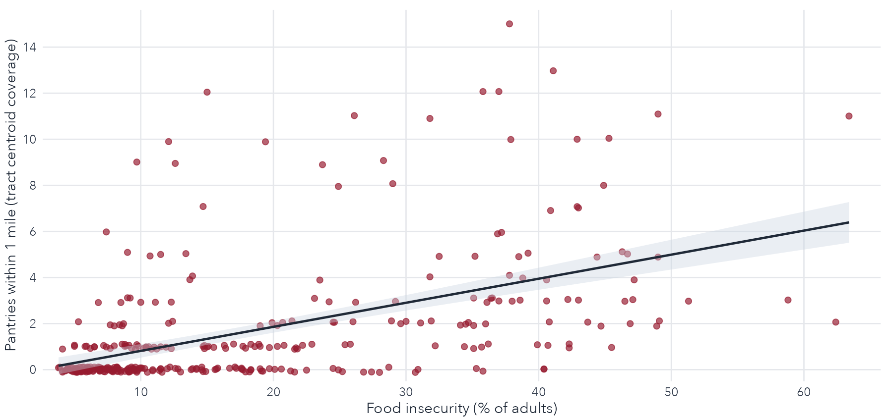

```{r}
#| include: false
suppressPackageStartupMessages({
  library(dplyr)
  library(ggplot2)
  library(scales)
  library(stringr)
})

source("../code/build_presentation_leaflet_maps.R")
maps <- build_presentation_leaflet_maps(
  tract_path = "../output/stl_food_access_tracts_reporting.gpkg",
  pantry_path = "../data/pantry_geocoded.rds",
  insecurity_csv_path = "../food_insecurity.csv",
  desert_csv_path = "../food_pantry_desert.csv",
  compare_csv_path = "../output/maps/food_pantry_source_comparison_sites.csv",
  use_online_tiles = TRUE
)

alignment_spearman <- cor(
  maps$scatter_df$prevalence_pct,
  maps$scatter_df$pantries_within_1mi,
  method = "spearman",
  use = "complete.obs"
)
```

## About Us {.text-slide .about-slide}

```{=html}
<div class="about-grid">
  <div class="about-card">
    
    <div class="about-name">Angela Gabel</div>
    <div class="about-title"><span class="about-affil">St. Louis Area Food Pantry Coalition</span></div>
  </div>
  <div class="about-card">
    
    <div class="about-name">Matthew Gabel, PhD</div>
    <div class="about-title"><span class="about-affil">Washington University in St. Louis</span></div>
  </div>
  <div class="about-card">
    
    <div class="about-name">Andrew Reeves, PhD</div>
    <div class="about-title"><span class="about-affil">Washington University in St. Louis</span></div>
  </div>
  <div class="about-card">
    
    <div class="about-name">Lukas Alexander</div>
    <div class="about-title"><span class="about-affil">Washington University in St. Louis</span></div>
  </div>
  <div class="about-card">
    
    <div class="about-name">Rose Jordan</div>
    <div class="about-title"><span class="about-affil">Washington University in St. Louis</span></div>
  </div>
  <div class="about-card">
    
    <div class="about-name">Hwayong Shin, PhD</div>
    <div class="about-title"><span class="about-affil">Washington University in St. Louis</span></div>
  </div>
</div>
```

## When Federal Policy Shifts, Local Systems Absorb the Shock {.text-slide .shock-simple-slide}

```{=html}
<div class="stat-grid-simple">
  <div class="stat-col">
    <div class="stat-value">650,000+</div>
    <div class="stat-label">Missouri SNAP recipients affected by Fall 2025 disbursement disruption</div>
  </div>
  <div class="stat-col">
    <div class="stat-value">54,943</div>
    <div class="stat-label">St. Louis recipients</div>
  </div>
  <div class="stat-col">
    <div class="stat-value">70 &#8594; 200</div>
    <div class="stat-label">Families served in one day at one pantry</div>
  </div>
</div>
<div class="shock-bottom-line">When federal support shifts, strain concentrates locally.</div>
<div class="slide-footnote">Sources: 650,000+ Missouri SNAP recipients: <a href="https://www.stlpr.org/government-politics-issues/2025-10-21/over-650-000-missourians-will-not-receive-november-snap-benefits-because-of-shutdown" target="_blank" rel="noopener">STLPR, Oct 21, 2025</a>. 54,943 St. Louis recipients and 70→200 pantry demand surge: <a href="https://www.stlpr.org/government-politics-issues/2025-11-07/food-fund" target="_blank" rel="noopener">STLPR, Nov 7, 2025</a>.</div>
```

## The Core Problem {.text-slide .core-question-slide}

<div class="core-question">Where are high-need neighborhoods<br>served by relatively thin pantry infrastructure?</div>

<div class="alignment-main">Nearby pantry presence does not consistently align</div>
<div class="alignment-sub">with tract-level food insecurity.</div>

This is a planning tool for outreach and referral targeting.

## How We Detect Gaps in the Local Support System {.text-slide .measure-slide .measure-model-slide}

```{=html}
<div class="measure-claim">We are mapping gaps in the support system.</div>
<div class="measure-subclaim">A geographic stress test of the local food support system.</div>

<div class="measure-flow">
  <span>High Need</span>
  <span class="measure-op">+</span>
  <span>Thin Coverage</span>
  
  <span>Gap Signal</span>
</div>

<div class="method-grid">
  <div class="method-card">
    <div class="method-title">Food insecurity</div>
    <div class="method-text">CDC PLACES 2023 tract estimate</div>
  </div>
  <div class="method-card">
    <div class="method-title">Pantry access</div>
    <div class="method-text">1-mile service-area coverage</div>
  </div>
  <div class="method-card">
    <div class="method-title">Combined signal (FPDI)</div>
    <div class="method-text">Standardized 0-100 gap index</div>
  </div>
</div>
```

## How to Use This Map {.text-slide .measure-guardrail-slide}

```{=html}
<div class="guardrail-blocks">
  <div class="guardrail-block">
    <div class="guardrail-title">What it does</div>
    <div class="guardrail-text">Flags tracts where need exceeds nearby pantry presence.</div>
  </div>
  <div class="guardrail-block">
    <div class="guardrail-title">What it does not do</div>
    <div class="guardrail-text">Not a measure of individual hardship.<br>Not a replacement for provider judgment.</div>
  </div>
</div>
```

## How the Index Is Built {.text-slide .index-build-slide}

Inputs

- CDC PLACES 2023 adult food insecurity prevalence
- St. Louis Area Foodbank pantry locations (geocoded)

Construction

- Build 1-mile service-area buffers around pantry sites
- Count pantry buffers covering each tract centroid
- Min-max scale unmet need to **0-100**

Higher values indicate larger gaps between need and nearby coverage.

## Food Insecurity Concentrates in North St. Louis {.map-slide}

Persistent vulnerability is geographically clustered.

::: {.map-embed}
```{r}
maps$map_food_insecurity
```
:::

## Pantries Cluster in Central Corridors {.map-slide}

Coverage is densest in central city corridors and thins in outer tracts.

::: {.map-embed}
```{r}
maps$map_pantry_footprint
```
:::

## Where High Need Meets Thin Coverage {.map-slide}

These tracts are candidates for targeted outreach and referral.

::: {.map-embed}
```{r}
maps$map_desert_index
```
:::

## Need and Pantry Presence Are Weakly Aligned {.chart-slide}

```{r}
#| include: false
scatter_plot <- ggplot(maps$scatter_df, aes(x = prevalence_pct, y = pantries_within_1mi)) +
  geom_jitter(color = "#971B2F", alpha = 0.68, size = 2.0, width = 0, height = 0.12) +
  geom_smooth(
    method = "lm",
    formula = y ~ x,
    se = TRUE,
    color = "#1f2937",
    fill = "#cbd5e1",
    linewidth = 0.9
  ) +
  scale_x_continuous(
    name = "Food insecurity (% of adults)",
    breaks = scales::pretty_breaks(6),
    expand = expansion(mult = c(0.02, 0.04))
  ) +
  scale_y_continuous(
    name = "Pantries within 1 mile (tract centroid coverage)",
    breaks = scales::pretty_breaks(6),
    expand = expansion(mult = c(0.02, 0.04))
  ) +
  theme_minimal(base_family = "Avenir Next") +
  theme(
    panel.grid.minor = element_blank(),
    panel.grid.major = element_line(color = "#e5e7eb", linewidth = 0.5),
    axis.title = element_text(size = 12, color = "#1f2937"),
    axis.text = element_text(size = 10, color = "#374151"),
    plot.margin = margin(8, 10, 2, 4)
  )

ggsave(
  filename = "visuals/scatter_need_pantry.png",
  plot = scatter_plot,
  width = 10,
  height = 4.7,
  dpi = 180,
  bg = "white"
)
```

```{=html}

```

Spearman correlation between food insecurity and nearby pantry coverage: **`r sprintf("%.2f", alignment_spearman)`**.

High-need tracts do not reliably have more nearby pantries.

## Limits to Keep in Mind {.text-slide .limits-slide}

- Proximity does not capture pantry capacity, hours, or eligibility.
- The 1-mile buffer is a proximity proxy, not a formal catchment boundary.
- Location data may be incomplete.
- Use as a planning signal, not a diagnostic tool.

## What This Enables in Practice {.text-slide .enable-slide}

```{=html}
<div class="takeaway-grid">
  <div class="takeaway-card">
    <div class="takeaway-title"><strong>Prioritize</strong></div>
    <div class="takeaway-text">Identify outreach-priority tracts.</div>
  </div>
  <div class="takeaway-card">
    <div class="takeaway-title"><strong>Validate</strong></div>
    <div class="takeaway-text">Pair index signals with provider knowledge.</div>
  </div>
  <div class="takeaway-card">
    <div class="takeaway-title"><strong>Coordinate</strong></div>
    <div class="takeaway-text">Use a common tract-level framework for outreach coordination.</div>
  </div>
</div>
```

## Next Steps {.text-slide .next-slide}

- Improve supply realism: add pantry capacity, hours, and eligibility constraints.
- Add time-sensitive access: incorporate mobile pantry schedules and seasonal shifts.
- Deploy a shared dashboard for partner-level planning and validation.

## Appendix: Source Comparison {.map-slide}

Pantry location data are broadly consistent across sources, with modest differences in coverage.

::: {.map-embed}
```{r}
maps$map_source_compare
```
:::
