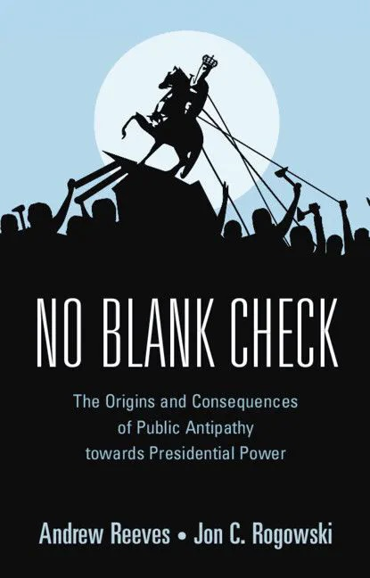
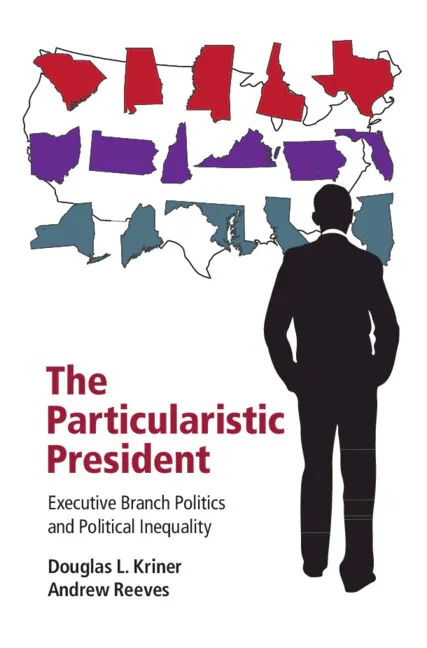

:::: {.page-content}
::: {.hero}
::: {.hero-grid}
::: {.hero-copy}
::: {.mobile-identity}
{.mobile-identity-photo alt="Portrait of Andrew Reeves"}

::: {.mobile-identity-meta}
<p class="mobile-identity-name">Andrew Reeves</p>
<p class="mobile-identity-year">© 2026</p>
<p class="mobile-identity-field">American Politics & Democratic Governance</p>
:::
:::

::: {.hero-eyebrow}
<i class="fa-solid fa-landmark-flag" aria-hidden="true"></i> American Politics and Democratic Governance
:::

<h1 class="hero-title">Andrew Reeves</h1>

::: {.hero-subtitle}
Political scientist studying presidential power, policy delivery, and democratic accountability in American governance.
:::

::: {.hero-actions}
[Research](research/){.btn .btn-primary}
[Curriculum Vitae](cv/){.btn .btn-outline}
[Media & Writing](news/){.btn .btn-outline}
:::

::: {.hero-bio}
Andrew Reeves studies how presidential leadership and institutional design shape public policy outcomes.

His research examines executive decision-making, federal resource allocation, and the conditions under which citizens hold leaders accountable when policy meets lived experience. Across projects, he links democratic accountability to institutional capacity and administrative action.

He is [Director of the Weidenbaum Center on the Economy, Government, and Public Policy](https://wc.washu.edu) at [Washington University in St. Louis](https://washu.edu), where he leads cross-disciplinary initiatives linking research, policy design, and public engagement.

Reeves also serves as [Senior Advisor to the Chancellor](https://andrewdmartin.washu.edu), helping advance the [Ordered Liberty Project](https://orderedliberty.washu.edu), a university-wide effort supporting academic freedom, open inquiry, and collaboration across schools and disciplines. He is a [Visiting Fellow at the Hoover Institution](https://www.hoover.org).

His research appears in leading journals and national media. He is coauthor of [*The Particularistic President*](https://www.cambridge.org/core/books/particularistic-president/1C2686B436BCBFAB3D46EDBD7C2A17C3) and [*No Blank Check*](https://www.cambridge.org/core/books/no-blank-check/0FE4E2FC0D017DC70566FDFE94B89007). Across this work, he combines empirical rigor with sustained attention to how institutions structure governance and everyday democratic experience.
:::

```{=html}
<button class="bio-toggle" type="button" aria-expanded="false">Read More</button>
```

```{=html}
<script>
document.addEventListener("DOMContentLoaded", function () {
  var bio = document.querySelector(".home-page .hero-bio");
  var toggle = document.querySelector(".home-page .bio-toggle");
  if (!bio || !toggle) return;

  toggle.addEventListener("click", function () {
    var expanded = bio.classList.toggle("is-expanded");
    toggle.setAttribute("aria-expanded", expanded ? "true" : "false");
    toggle.textContent = expanded ? "Read Less" : "Read More";
  });
});
</script>
```
:::

::: {.hero-aside}
{.hero-photo alt="Portrait of Andrew Reeves"}

::: {.role-card}
::: {.appointment-group}
<p class="appointment-role">Director, Weidenbaum Center on the Economy, Government, and Public Policy</p>
<p class="appointment-institution">Washington University in St. Louis</p>
:::

::: {.appointment-group}
<p class="appointment-role">Professor of Political Science</p>
<p class="appointment-institution">Washington University in St. Louis</p>
:::

::: {.appointment-group}
<p class="appointment-role">Senior Advisor to the Chancellor</p>
<p class="appointment-institution">Washington University in St. Louis</p>
:::

::: {.appointment-group}
<p class="appointment-role">Visiting Fellow</p>
<p class="appointment-institution">Hoover Institution</p>
:::
:::
:::
:::
:::

::: {.pull-quote}
> Reeves’s research explains how power is exercised, how policy is delivered, and when democratic accountability succeeds or fails.
:::

::: {.section}
## Research Themes {.section-title}

::: {.grid-2 .research-theme-grid}
::: {.card .research-theme-card}
::: {.research-theme-content}
<span class="tag research-theme-tag">Presidential Power</span>
<h3 class="research-theme-title"><span class="research-theme-icon"><i class="fa-solid fa-building-columns" aria-hidden="true"></i></span><span class="research-theme-heading">Presidential Power and Public Constraint</span></h3>

How presidents lead, especially when acting without Congress, and how public opinion and institutional checks constrain executive discretion.
:::
:::

::: {.card .research-theme-card}
::: {.research-theme-content}
<span class="tag research-theme-tag">Geography</span>
<h3 class="research-theme-title"><span class="research-theme-icon"><i class="fa-solid fa-map-location-dot" aria-hidden="true"></i></span><span class="research-theme-heading">Geography and Political Experience</span></h3>

How political behavior and government experience differ across urban, suburban, and rural communities, and why those divides shape polarization and representation.
:::
:::

::: {.card .research-theme-card}
::: {.research-theme-content}
<span class="tag research-theme-tag">Accountability</span>
<h3 class="research-theme-title"><span class="research-theme-icon"><i class="fa-regular fa-rectangle-list" aria-hidden="true"></i></span><span class="research-theme-heading">Voter Behavior and Political Accountability</span></h3>

When citizens reward or punish leaders, and how visibility, timing, and policy design shape democratic accountability.
:::
:::

::: {.card .research-theme-card}
::: {.research-theme-content}
<span class="tag research-theme-tag">Federal Policy</span>
<h3 class="research-theme-title"><span class="research-theme-icon"><i class="fa-solid fa-circle-dollar-to-slot" aria-hidden="true"></i></span><span class="research-theme-heading">Federal Spending and Resource Allocation</span></h3>

How presidents allocate resources across states and communities, with attention to strategic targeting, inequality, and institutional bias.
:::
:::
:::
:::

::: {.section}
## Books {.section-title}

Books examining presidential power, distributive politics, and democratic inequality.

:::: {.book-item}
{.book-cover alt="Cover of No Blank Check"}

### No Blank Check: The Origins and Consequences of Public Antipathy toward Presidential Power

[Cambridge University Press, 2022](https://www.amazon.com/Blank-Check-Consequences-Antipathy-Presidential/dp/1316626474/), with [Jon C. Rogowski](https://voices.uchicago.edu/jrogowski/)

*No Blank Check* shows that public support for presidential power is conditional rather than automatic, and that citizens impose meaningful constraints on executive action.
::::

:::: {.book-item}
{.book-cover alt="Cover of The Particularistic President"}

### The Particularistic President: Executive Branch Politics and Political Inequality

[Cambridge University Press, 2016](https://www.amazon.com/Particularistic-President-Executive-Political-Inequality/dp/1107616816/), with [Douglas Kriner](http://blogs.cornell.edu/kriner/)

This book examines how presidents target distributive benefits to favored constituencies, with implications for representation and democratic equality.
::::
:::
::::
