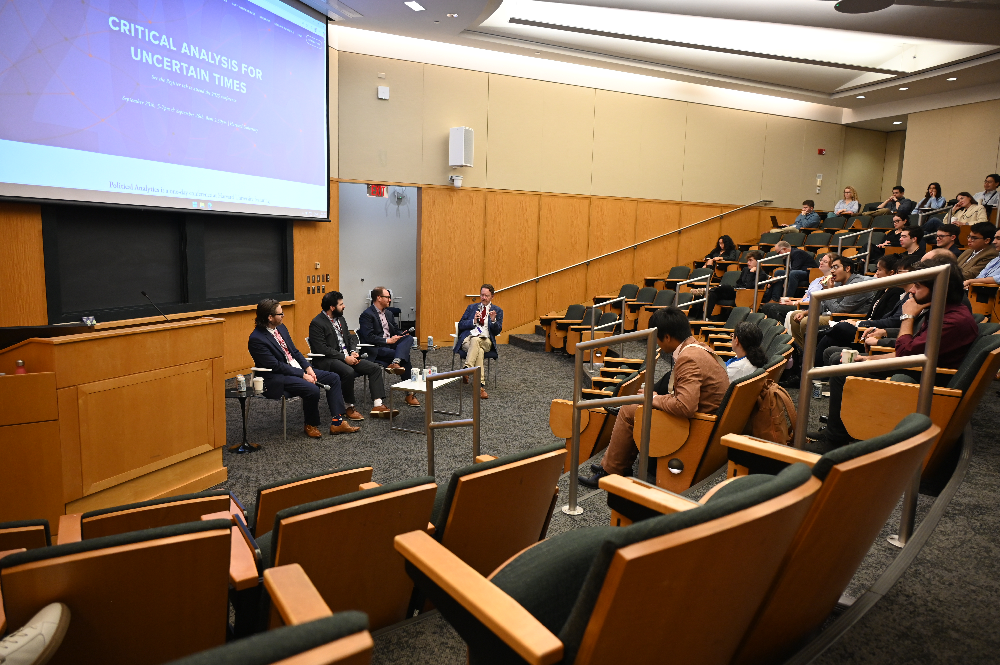

::: {.simple-layout}
::: {.page-intro}
## <i class="fa-solid fa-newspaper" aria-hidden="true"></i> Public Writing and Research Coverage {.page-intro-title}
Selected commentary and coverage of Andrew Reeves’s work on presidential power, disaster politics, and democratic accountability.
:::

::: {.teaching-spotlight}
::: {.teaching-spotlight-media}
{.teaching-spotlight-photo alt="Election Analyst Panel at Political Analytics 2025, moderated by Andrew Reeves at Harvard University"}
:::

::: {.teaching-spotlight-copy}
Featured Panel

Andrew Reeves moderates the Election Analyst Panel at Political Analytics 2025 at Harvard University, featuring Dave Wasserman, Jacob Rubashkin, and Geoffrey Skelley.
:::
:::

::: {.section}
## Recent Commentary {.section-title}

Essays and op-eds on presidential power, disaster politics, and electoral accountability.

::: {.news-timeline}
- **[Trump treats laws as obstacles, not limits − and the only real check on his rule-breaking can come from political pressure](https://theconversation.com/trump-treats-laws-as-obstacles-not-limits-and-the-only-real-check-on-his-rule-breaking-can-come-from-political-pressure-255834)**
  
The Conversation • May 21, 2025

- **[Biden and Trump will talk big at the debate, but how much could either really do?](https://www.latimes.com/opinion/story/2024-06-25/biden-trump-debate-presidential-campaign)**
  
Los Angeles Times • June 25, 2024

- **[Biden's Supreme Court commission probably won't sway public opinion](https://theconversation.com/bidens-supreme-court-commission-probably-wont-sway-public-opinion-159658)**
  
The Conversation • June 16, 2021

- **[This pandemic is a test for leaders. Voters do the grading](https://www.stltoday.com/opinion/columnists/andrew-reeves-this-pandemic-is-a-test-for-leaders-voters-do-the-grading/article_80a024d0-8128-5d4a-809a-122d594e517a.html)**
  
Saint Louis Post-Dispatch • April 1, 2020

- **[If Trump took responsibility for coronavirus missteps, it might actually help him](https://www.washingtonpost.com/politics/2020/03/26/if-trump-took-responsibility-coronavirus-missteps-it-might-actually-help-him/)**
  
Washington Post • March 2020

- **[Donald Trump's lukewarm response to Puerto Rico was pretty predictable. Here's why](https://www.washingtonpost.com/news/monkey-cage/wp/2017/10/02/puerto-rican-residents-dont-vote-for-president-or-congress-could-that-affect-trumps-response-to-hurricane-maria/)**
  
Washington Post • October 2, 2017

- **[Florida Disaster Aid Can Help Bush](../papers/disasters-latimes1.pdf)**
  
Los Angeles Times • October 3, 2004

- **[Plucking Votes From Disasters](../papers/disasters-latimes2.pdf)**
  
Los Angeles Times • May 12, 2004

:::
:::

::: {.section}
## Selected Research in the Media {.section-title}

::: {.news-timeline}
- **[Swing-State Politics Is Rotting Our Brains and Harming Democracy](https://slate.com/news-and-politics/2024/10/us-presidential-election-swing-state-politics-harming-democracy.html)**
  
Slate • October 2024

- **[Trump seeks to boost presidential bid in Hurricane Helene's wake, analysts say](https://www.reuters.com/world/us/wake-hurricane-trump-seeks-boost-his-presidential-bid-2024-10-01/)**
  
Reuters • October 2024

- **[Columbia's political-social climate heavily influenced by University of Missouri](https://www.columbiatribune.com/story/news/politics/2024/02/18/columbia-political-social-climate-heavily-influenced-university-of-missouri/72588606007/)**
  
Columbia Tribune • February 18, 2024

- **[Checking the American Presidency](https://lawliberty.org/book-review/checking-the-american-presidency/)**
  
Law & Liberty • January 24, 2023

- **[Perception matters: How fear about crime impacts presidential approval](https://source.washu.edu/2022/04/perception-matters-how-fear-about-crime-impacts-presidential-approval/)**
  
WashU Source • April 2022

- **[How local and national leaders are tested by major natural disasters](https://www.npr.org/2022/10/01/1126239235/politics-natural-disasters-desantis-hurricane-ian)**
  
NPR • October 2022

- **[Biden Surveys Hurricane Damage in Florida Amid Tension With Governor](https://www.voanews.com/a/biden-to-survey-hurricane-ian-damage-in-florida/6776635.html)**
  
Voice of America • October 2022

- **[Devastating Tornadoes Give Biden One Last Chance to Bridge Red-Blue Rift](https://www.thedailybeast.com/devastating-tornadoes-give-biden-one-last-chance-to-bridge-red-blue-rift)**
  
The Daily Beast • December 2021

- **[Partisanship, the economy, and presidential accountability](https://source.washu.edu/2021/10/partisanship-the-economy-and-presidential-accountability/)**
  
WashU Source • October 2021

- **[Texas's Disaster Is Over. The Fallout Is Just Beginning](https://www.theatlantic.com/politics/archive/2021/02/what-texas-energy-crisis-means-democrats/618127/)**
  
The Atlantic • February 2021

- **[The Economy is Collapsing. So Are Trump's Reelection Chances](https://www.theatlantic.com/ideas/archive/2020/04/most-important-number-trumps-re-election-chances/609376/)**
  
The Atlantic • April 2020

- **[The divide between us: Urban-rural political differences rooted in geography](https://source.washu.edu/2020/02/the-divide-between-us-urban-rural-political-differences-rooted-in-geography/)**
  
WashU Source • February 2020

- **[Counties that voted for the president get more in disaster relief](https://www.economist.com/news/united-states/21730430-federal-aid-sent-puerto-rico-fits-longstanding-pattern-counties-voted)**
  
The Economist • October 2017

- **[Disaster Politics Can Get In The Way Of Disaster Preparedness](https://fivethirtyeight.com/features/disaster-politics-can-get-in-the-way-of-disaster-preparedness/)**
  
FiveThirtyEight • August 2017

- **[Good to Know: What is sociotropic voting in politics?](https://goodauthority.org/news/good-to-know-what-is-sociotropic-voting-politics/)**
  
Good Authority

- **[Do presidents really reward the states that voted them into office?](https://www.washingtonpost.com/blogs/wonkblog/wp/2013/08/29/do-presidents-really-reward-the-states-that-voted-them-into-office/)**
  
Washington Post • August 2013

- **[How Hurricane Sandy Could Matter on Election Day](https://goodauthority.org/news/how-hurricane-sandy-could-matter-on-election-day/)**
  
The Monkey Cage • October 2012

:::
:::
:::
