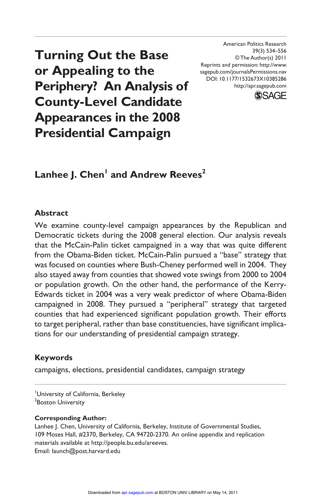

{.featured-image}

## Research Question

Within swing states, do presidential candidates concentrate appearances in partisan base counties or in competitive peripheral counties?

## Main Finding

In 2008, McCain-Palin pursued a base strategy, campaigning in Republican strongholds, while Obama-Biden used a peripheral strategy focused on high-growth, less partisan counties. These choices reflect divergent campaign strategies with implications for electoral outreach.

## Research Design

Empirical analysis of county-level campaign appearance data during the 2008 general election.

## Data Employed

Original dataset of all candidate appearances in 2008, linked to county demographics, past vote margins, and population changes.

## Substantive Importance

Offers a rare look inside campaign decision-making within battleground states. Reveals how geography and demography interact in presidential campaign strategy, and why campaigns might ignore swing areas in favor of predictable partisan terrain.

## Research Areas

Campaign Strategy, Presidential Elections, Electoral Geography, Swing States, County-Level Analysis

## Citation

```bibtex
@article{appearances,
  author = {Chen, Lanhee J. and Reeves, Andrew},
  title = {Turning Out the Base or Appealing to the Periphery? An Analysis of County-Level Candidate Appearances in the 2008 Presidential Campaign},
  journal = {American Politics Research},
  volume = {39},
  number = {3},
  pages = {534--556},
  year = {2011},
}
```

## Links

- [📄 PDF](../../papers/appearances.pdf)
- [🏛️ Publisher](https://journals.sagepub.com/doi/abs/10.1177/1532673x10385286)
- [🎓 Google Scholar](https://scholar.google.com/scholar?q=Turning%20Out%20the%20Base%20or%20Appealing%20to%20the%20Periphery%3F%20An%20Analysis%20of%20County-Level%20Candidate%20Appearances%20in%20the%202008%20Presidential%20Campaign)
