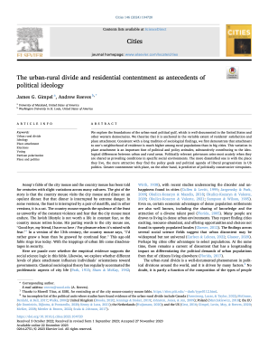

{.featured-image}

## Research Question

What explains the ideological differences between urban and rural residents, and how does attachment to place shape political attitudes?

## Main Finding

Rural residents report higher levels of neighborhood attachment than urban residents. This variation in place attachment contributes significantly to ideological divides, with contentment predicting conservatism and dissatisfaction predicting liberalism.

## Research Design

The authors use survey data and a place-based theoretical framework to evaluate how place attachment and residential satisfaction relate to political ideology.

## Data Employed

National survey data capturing attitudes about place and politics, along with demographic and geographic information to compare rural and urban populations.

## Substantive Importance

The study provides a sociological explanation for geographic polarization, showing how emotional and social bonds to place inform political beliefs. This contributes to our understanding of the urban-rural divide in electoral politics.

## Research Areas

Urban-Rural Divide, Electoral Geography, Geographic Context, Public Opinion, Polarization

## Citation

```bibtex
@article{attachment,
  author = {Gimpel, James G. and Reeves, Andrew},
  title = {The Urban-Rural Divide and Residential Contentment as Antecedents of Political Ideology},
  journal = {Cities},
  volume = {146},
  pages = {104720},
  year = {2024},
}
```

## Links

- [📄 PDF](/papers/attachment.pdf)
- [🎓 Google Scholar](https://scholar.google.com/scholar?q=The%20Urban-Rural%20Divide%20and%20Residential%20Contentment%20as%20Antecedents%20of%20Political%20Ideology)