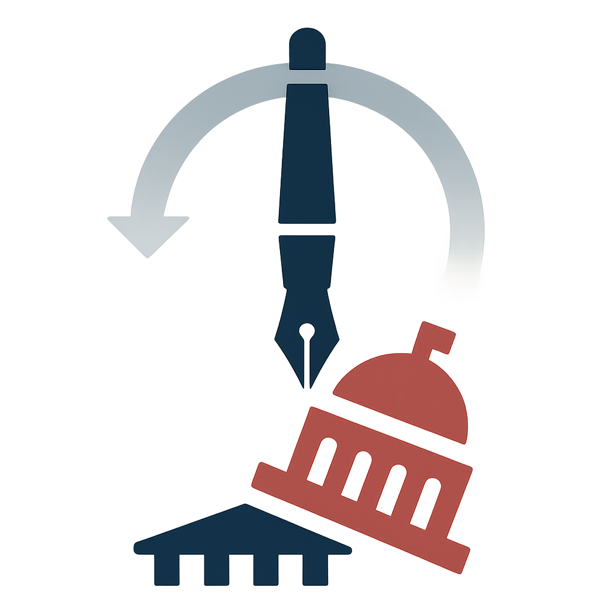

{.featured-image}

## Research Question

How do legal and political constraints shape the use of unilateral executive power by U.S. presidents?

## Main Finding

Legal and political constraints significantly reduce the likelihood that presidents will act unilaterally. Presidents are more likely to issue executive orders when courts and Congress are less likely to oppose them, indicating that constraints are binding, not merely symbolic.

## Research Design

The study employs formal theory and an empirical analysis of unilateral executive orders from 1945 to 2012, evaluating when and why presidents choose to act without Congress.

## Data Employed

Archival data on executive orders, legislative gridlock indicators, judicial context, and interbranch conflict.

## Substantive Importance

The paper challenges the idea that presidents can act unilaterally at will. It shows how institutional design and interbranch relationships limit executive power, deepening our understanding of the presidency and separation of powers.

## Research Areas

Presidential Power, Institutional Constraints, Separation Of Powers, Formal Theory, Quantitative Methods

## Citation

```bibtex
@article{constraints,
  author = {Reeves, Andrew and Rogowski, Jon C.},
  title = {The Public Cost of Unilateral Action},
  journal = {American Journal of Political Science},
  volume = {62},
  number = {2},
  pages = {424--440},
  year = {2018},
}
```

## Links

- [📄 PDF](/papers/constraints.pdf)
- [🎓 Google Scholar](https://scholar.google.com/scholar?q=The%20Public%20Cost%20of%20Unilateral%20Action)