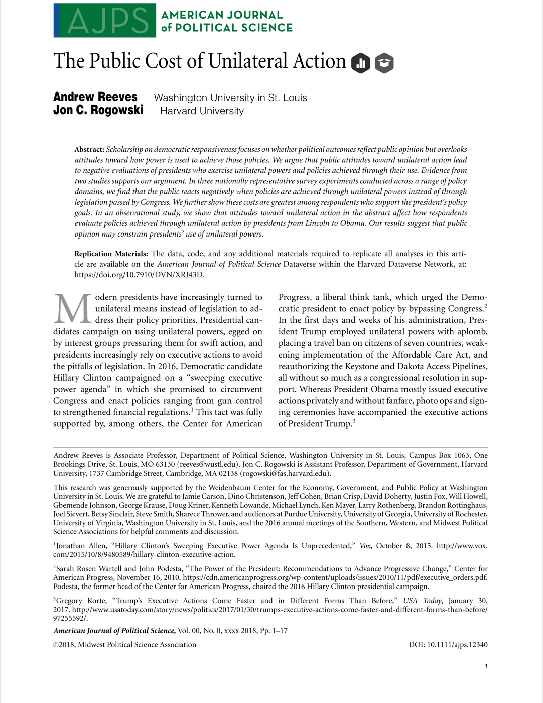

{.featured-image}

## Research Question

How does the public evaluate policy outcomes achieved through unilateral presidential action versus legislation?

## Main Finding

Across multiple policy domains, respondents evaluate presidents and policies more negatively when outcomes are achieved unilaterally rather than through Congress. These penalties are often strongest among policy supporters, indicating principled concern over how power is exercised.

## Research Design

The study combines three nationally representative survey experiments with an observational analysis linking general attitudes toward unilateral action to evaluations of historical presidential actions.

## Data Employed

Experimental survey data across policy scenarios and observational survey evidence on evaluations of unilateral actions by presidents from Lincoln through Obama.

## Substantive Importance

The paper shows that democratic accountability concerns apply not only to policy outcomes but also to the process used to produce them. It suggests presidents may face electoral incentives to prefer legislating through Congress over acting alone.

## Research Areas

Presidential Power, Public Opinion, Unilateral Action, Democratic Accountability, Survey Experiments

## Citation

```bibtex
@article{constraints,
  author = {Reeves, Andrew and Rogowski, Jon C.},
  title = {The Public Cost of Unilateral Action},
  journal = {American Journal of Political Science},
  volume = {62},
  number = {2},
  pages = {424--440},
  year = {2018},
}
```

## Links

- [📄 PDF](../../papers/constraints.pdf)
- [🎓 Google Scholar](https://scholar.google.com/scholar?q=The%20Public%20Cost%20of%20Unilateral%20Action)
