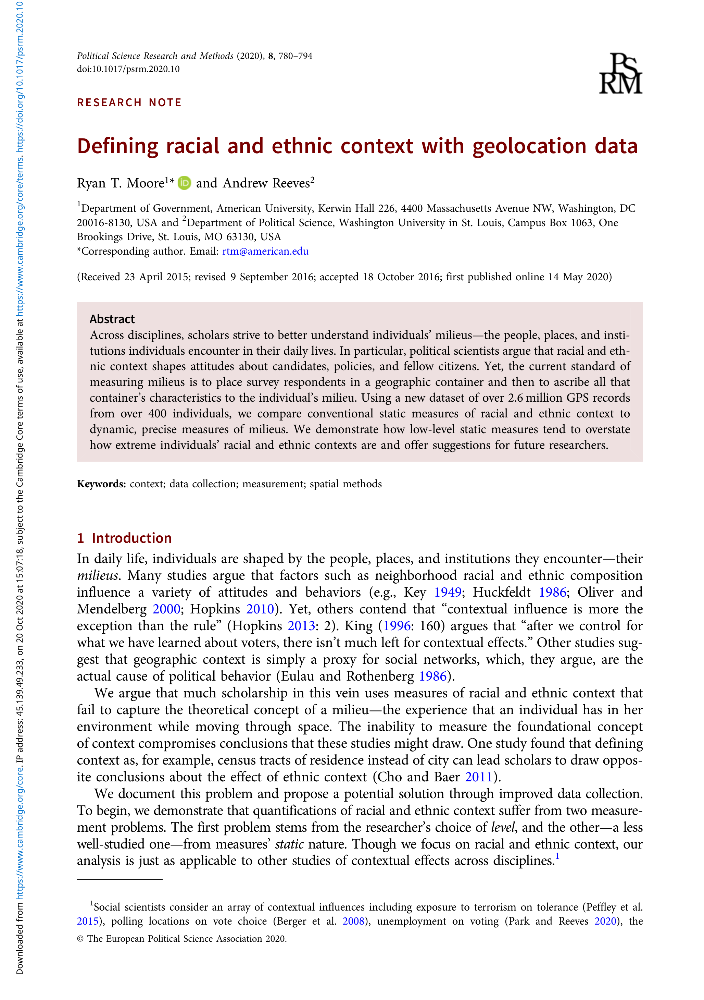

{.featured-image}

## Research Question

How does the political context shape public evaluations of presidential power and the use of executive orders?

## Main Finding

Public support for executive orders depends heavily on partisan alignment. When presidents use unilateral tools, co-partisans reward them and out-partisans punish them–-regardless of the issue or justification.

## Research Design

Survey experiments varying the identity of the president, the issue area, and the type of justification given for an executive order.

## Data Employed

Experimental data from large national surveys examining public reaction to hypothetical uses of executive power.

## Substantive Importance

This study shows how partisan polarization shapes not only elite behavior but also mass attitudes toward executive power. It reveals a key mechanism behind the erosion of consensus on constitutional norms.

## Research Areas

Research Methods, Survey Research, Geographic Context, Electoral Geography, Quantitative Methods

## Citation

```bibtex
@article{context,
  author = {Moore, Ryan T. and Reeves, Andrew},
  title = {Defining Racial and Ethnic Context with Geolocation Data},
  journal = {Political Science Research and Methods},
  volume = {8},
  number = {4},
  pages = {780-794},
  year = {2020},
}
```

## Links

- [📄 PDF](/papers/context.pdf)
- [🎓 Google Scholar](https://scholar.google.com/scholar?q=Defining%20Racial%20and%20Ethnic%20Context%20with%20Geolocation%20Data)