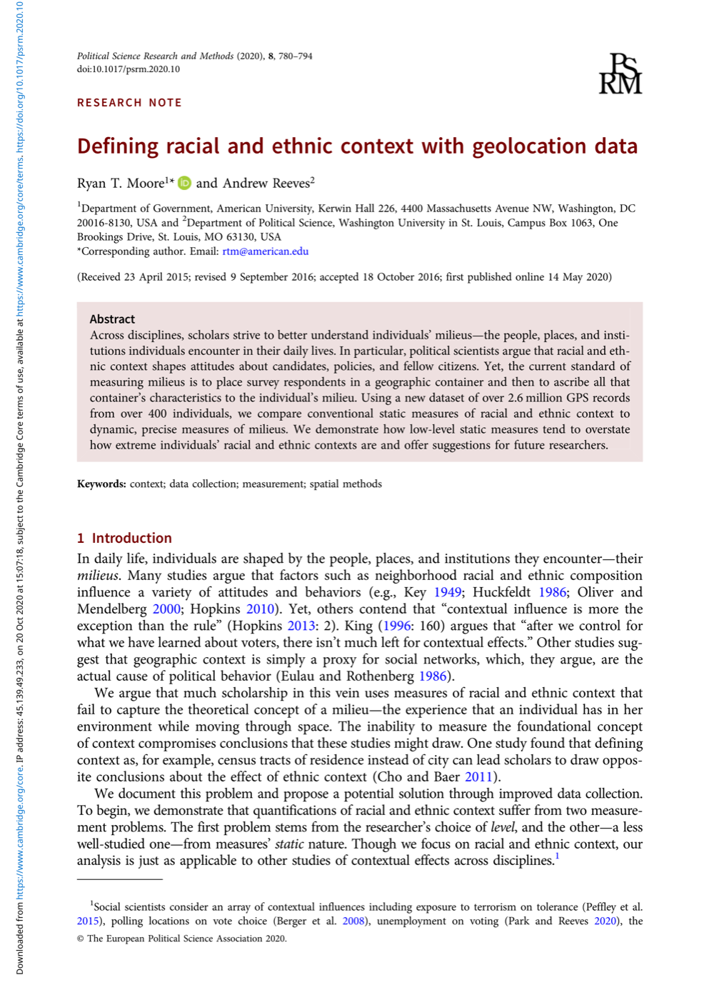

{.featured-image}

## Research Question

How can geolocation data improve the measurement of racial and ethnic context in political behavior research?

## Main Finding

High-resolution geolocation methods produce more accurate and substantively meaningful measures of racial and ethnic context than broader geographic aggregates. The approach reduces measurement error and better captures the environments individuals actually experience.

## Research Design

Methodological study comparing context measures built from geolocation data against traditional areal units, with validation across empirical applications.

## Data Employed

Geocoded individual-level records linked to census-based demographic context at multiple spatial scales.

## Substantive Importance

The paper provides a stronger foundation for studying contextual effects in political science. Better spatial measurement improves inference about how local racial and ethnic environments shape attitudes and behavior.

## Research Areas

Research Methods, Survey Research, Geographic Context, Electoral Geography, Quantitative Methods

## Citation

```bibtex
@article{context,
  author = {Moore, Ryan T. and Reeves, Andrew},
  title = {Defining Racial and Ethnic Context with Geolocation Data},
  journal = {Political Science Research and Methods},
  volume = {8},
  number = {4},
  pages = {780-794},
  year = {2020},
}
```

## Links

- [📄 PDF](../../papers/context.pdf)
- [🎓 Google Scholar](https://scholar.google.com/scholar?q=Defining%20Racial%20and%20Ethnic%20Context%20with%20Geolocation%20Data)
