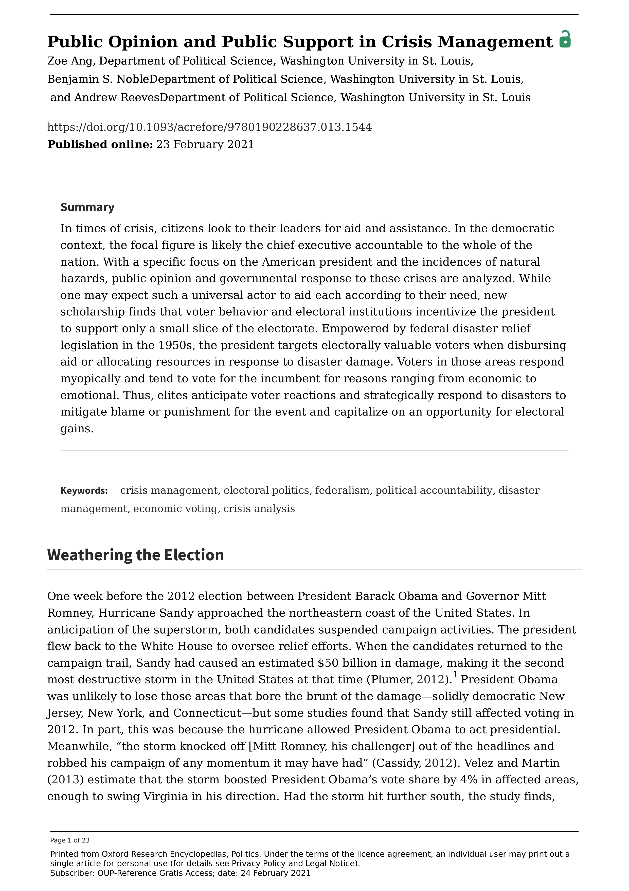

{.featured-image style="max-width: 600px; max-height: 400px; width: auto; height: auto;"}

## Research Question

How do presidents use unilateral executive tools during national crises, and how does crisis influence their likelihood of acting alone?

## Main Finding

Presidents are more likely to act unilaterally during national crises, especially when the public demands swift action and institutional constraints are relaxed. The likelihood of unilateral action increases in response to crises in both foreign and domestic policy domains.

## Research Design

Theoretical modeling combined with empirical analysis of unilateral presidential actions from 1945 to 2006, including executive orders and other directives.

## Data Employed

Historical data on presidential directives and crises, categorized by type and severity, along with institutional control variables.

## Substantive Importance

This paper contributes to our understanding of how emergency conditions alter the balance of power in American government. It raises important normative questions about democratic accountability during times of crisis.

## Research Areas

Crisis Management, Presidential Power, Public Opinion, Institutional Constraints, Democratic Accountability

## Citation

```bibtex
@incollection{crisis,
  author = {Ang, Zoe and Noble, Benjamin and Reeves, Andrew},
  title = {Public Opinion and Public Support in Crisis Management},
  booktitle = {Encyclopedia of Crisis Analysis},
  publisher = {Oxford University Press},
  year = {2021},
}
```

## Links

- [📄 PDF](/papers/crisis.pdf)
- [🎓 Google Scholar](https://scholar.google.com/scholar?q=Public%20Opinion%20and%20Public%20Support%20in%20Crisis%20Management)