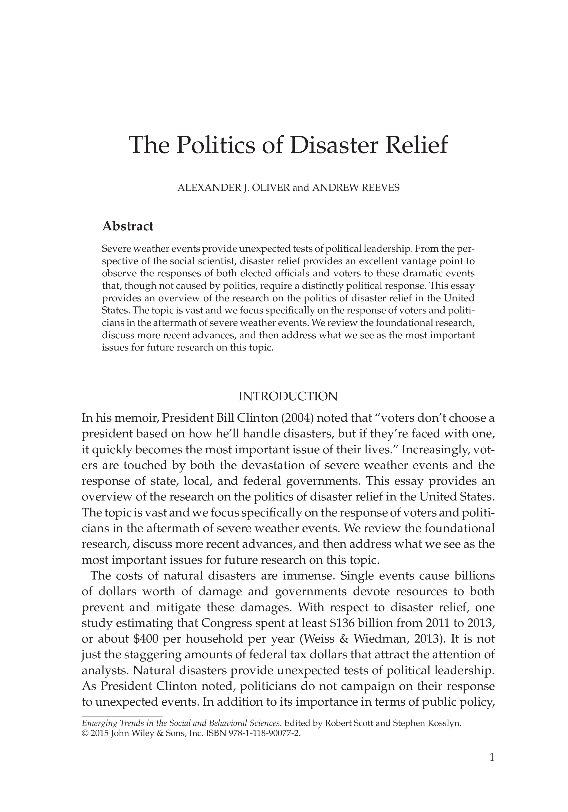

{.featured-image}

## Research Question

What does existing research say about how natural disasters affect political behavior and government accountability?

## Main Finding

Citizens tend to reward incumbents for disaster relief spending and punish them for slow or ineffective responses, regardless of actual preparedness. Disasters also exacerbate inequalities in political attention and resource allocation.

## Research Design

A synthetic review of empirical studies and theoretical frameworks from political science and public administration concerning disaster politics.

## Data Employed

The paper draws on dozens of published studies using survey data, disaster declarations, electoral outcomes, and case analyses.

## Substantive Importance

This review integrates fragmented research to clarify how natural disasters shape democratic accountability. It highlights persistent challenges in achieving equity and responsiveness in disaster policy.

## Research Areas

Disaster Politics, Electoral Behavior, Literature Review, Democratic Accountability, Public Policy

## Citation

```bibtex
@incollection{disasters-review,
  author = {Oliver, Alexander and Reeves, Andrew},
  title = {The Politics of Disaster Relief},
  booktitle = {Emerging Trends in the Behavioral and Social Science},
  publisher = {John Wiley \& Sons, Inc},
  year = {2015},
}
```

## Links

- [📄 PDF](/papers/disasters-review.pdf)
- [🎓 Google Scholar](https://scholar.google.com/scholar?q=The%20Politics%20of%20Disaster%20Relief)