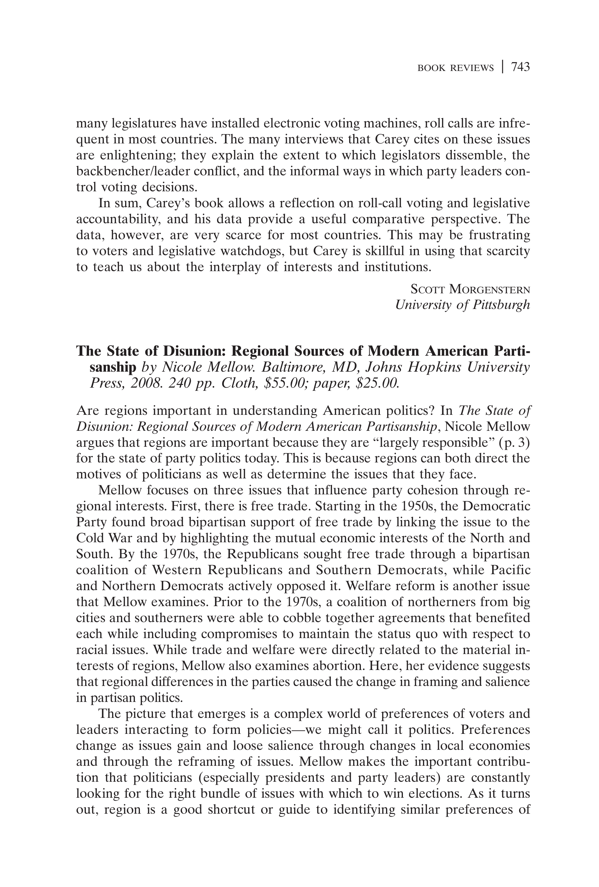

{.featured-image style="max-width: 600px; max-height: 400px; width: auto; height: auto;"}

## Research Areas

Book Review, Electoral Geography, Partisanship, Polarization

## Citation

```bibtex
@article{disunion-review,
  author = {Reeves, Andrew},
  title = {Review of <i>The State of Disunion: Regional Sources of Modern American Partisanship</i> by Nicole Mellow},
  journal = {Political Science Quarterly},
  volume = {124},
  number = {4},
  pages = {743--744},
  year = {2009},
}
```

## Links

- [📄 PDF](/papers/disunion-review.pdf)
- [🎓 Google Scholar](https://scholar.google.com/scholar?q=Review%20of%20%3Ci%3EThe%20State%20of%20Disunion%3A%20Regional%20Sources%20of%20Modern%20American%20Partisanship%3C/i%3E%20by%20Nicole%20Mellow)