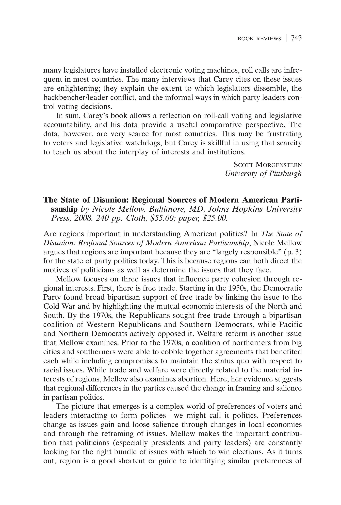

{.featured-image}

## Research Question

How does regional context shape modern American partisanship, and what does this imply for national polarization?

## Main Finding

The review highlights evidence that regional political and economic contexts structure partisan conflict in durable ways. National party competition is deeply rooted in geographically distinct coalitions and issue priorities.

## Research Design

Critical book review and conceptual synthesis of a major contribution in political geography and party politics.

## Data Employed

Evidence summarized from Mellow's historical, institutional, and electoral analysis of regional partisan development in the United States.

## Substantive Importance

The review underscores that polarization is not only ideological but spatially organized. It situates regional cleavage as a central mechanism in the evolution of modern U.S. partisanship.

## Research Areas

Book Review, Electoral Geography, Partisanship, Polarization

## Citation

```bibtex
@article{disunion-review,
  author = {Reeves, Andrew},
  title = {Review of <i>The State of Disunion: Regional Sources of Modern American Partisanship</i> by Nicole Mellow},
  journal = {Political Science Quarterly},
  volume = {124},
  number = {4},
  pages = {743--744},
  year = {2009},
}
```

## Links

- [📄 PDF](../../papers/disunion-review.pdf)
- [🎓 Google Scholar](https://scholar.google.com/scholar?q=Review%20of%20%3Ci%3EThe%20State%20of%20Disunion%3A%20Regional%20Sources%20of%20Modern%20American%20Partisanship%3C/i%3E%20by%20Nicole%20Mellow)
