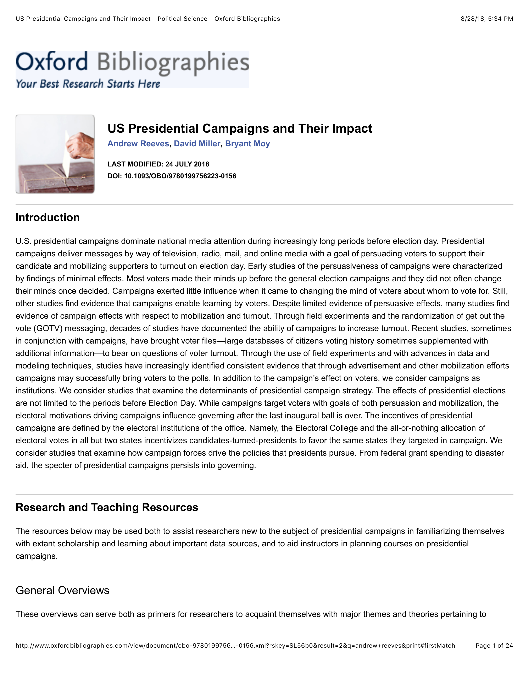

{.featured-image style="max-width: 600px; max-height: 400px; width: auto; height: auto;"}

## Research Areas

Campaign Strategy, Presidential Elections, Electoral Behavior, Literature Review

## Citation

```bibtex
@incollection{electionsbib,
  author = {Miller, David and Moy, Bryant and Reeves, Andrew},
  title = {U.S. Presidential Campaigns and Their Impact},
  booktitle = {Oxford Bibliographies in Political Science},
  publisher = {Oxford University Press},
  year = {2018},
}
```

## Links

- [📄 PDF](/papers/electionsbib.pdf)
- [🎓 Google Scholar](https://scholar.google.com/scholar?q=U.S.%20Presidential%20Campaigns%20and%20Their%20Impact)