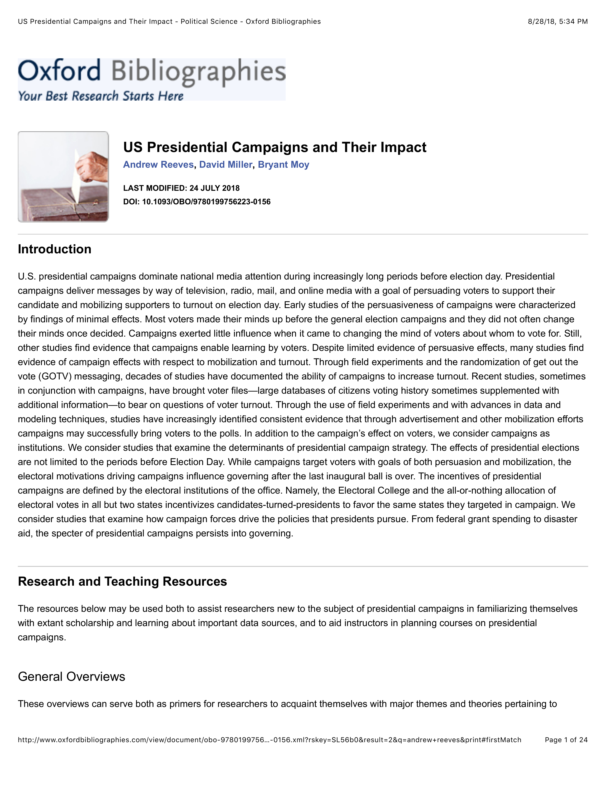

{.featured-image}

## Research Question

What does the research literature show about how U.S. presidential campaigns influence voters, participation, and election outcomes?

## Main Finding

Campaign effects are real but conditional. Their influence depends on political context, voter predispositions, information environments, and strategic choices by campaigns.

## Research Design

Structured literature review in *Oxford Bibliographies* that organizes core debates, empirical findings, and methodological approaches in presidential campaign research.

## Data Employed

Published scholarship on presidential campaign strategy, communication, mobilization, voter decision making, and electoral outcomes.

## Substantive Importance

The essay provides a map of what is known, contested, and still unresolved about campaign effects. It offers an entry point for students and researchers building new work in electoral behavior and campaign politics.

## Research Areas

Campaign Strategy, Presidential Elections, Electoral Behavior, Literature Review

## Citation

```bibtex
@incollection{electionsbib,
  author = {Miller, David and Moy, Bryant and Reeves, Andrew},
  title = {U.S. Presidential Campaigns and Their Impact},
  booktitle = {Oxford Bibliographies in Political Science},
  publisher = {Oxford University Press},
  year = {2018},
}
```

## Links

- [📄 PDF](../../papers/electionsbib.pdf)
- [🎓 Google Scholar](https://scholar.google.com/scholar?q=U.S.%20Presidential%20Campaigns%20and%20Their%20Impact)
