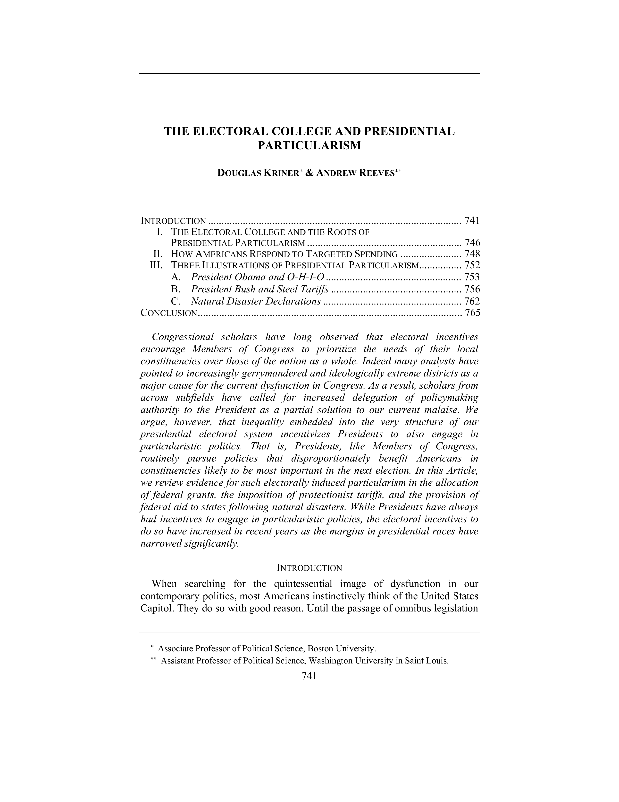

{.featured-image}

## Research Question

How does the Electoral College shape presidential campaign strategies and voter representation?

## Main Finding

The Electoral College incentivizes campaigns to focus disproportionately on swing states and overlook safe states, leading to unequal representation and resource allocation. The system magnifies the influence of a small number of voters in competitive areas.

## Research Design

Empirical analysis of campaign appearances, spending, and media coverage during recent presidential elections, combined with simulation models of counterfactual election outcomes.

## Data Employed

Data on campaign activity from the 2000 through 2012 elections, including candidate visits and advertising, along with national vote totals.

## Substantive Importance

The study underscores the democratic deficits of the Electoral College, particularly in terms of unequal influence and participation. It informs ongoing debates about electoral reform and the structure of American presidential elections.

## Research Areas

Campaign Strategy, Swing States, Presidential Elections, Democratic Accountability, Institutional Design

## Citation

```bibtex
@article{electoralcollege,
  author = {Kriner, Douglas L. and Reeves, Andrew},
  title = {The Electoral College and Presidential Particularism},
  journal = {Boston University Law Review},
  volume = {94},
  number = {3},
  pages = {741--766},
  year = {2014},
}
```

## Links

- [📄 PDF](/papers/electoralcollege.pdf)
- [🎓 Google Scholar](https://scholar.google.com/scholar?q=The%20Electoral%20College%20and%20Presidential%20Particularism)