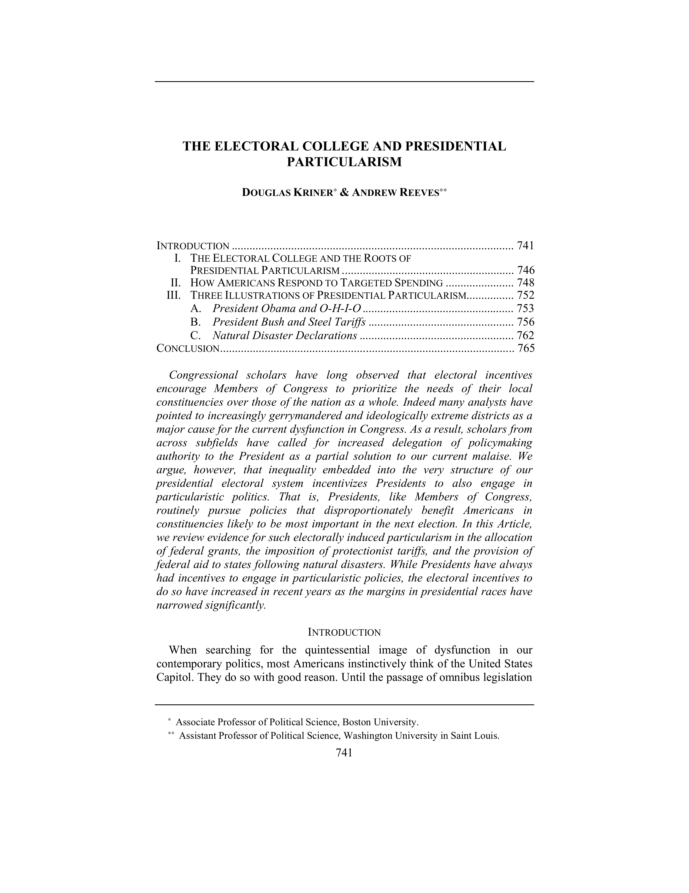

{.featured-image}

## Research Question

How does the Electoral College shape incentives for presidents to distribute policy benefits and government action across places?

## Main Finding

The Electoral College's unequal weighting of states incentivizes presidents to target benefits to electorally valuable constituencies. Evidence from grants, tariffs, and disaster declarations illustrates systematic presidential particularism.

## Research Design

Institutional and legal analysis paired with empirical illustrations of executive distributive behavior across policy domains.

## Data Employed

Evidence drawn from research on federal grant allocation, trade protection decisions, and presidential disaster declaration patterns, plus public-opinion evidence on reactions to targeted spending.

## Substantive Importance

The article challenges the view that presidents are naturally universal representatives and shows how electoral institutions can generate unequal governance across citizens and places.

## Research Areas

Presidential Politics, Electoral Institutions, Distributive Politics, Political Inequality, Democratic Accountability

## Citation

```bibtex
@article{electoralcollege,
  author = {Kriner, Douglas L. and Reeves, Andrew},
  title = {The Electoral College and Presidential Particularism},
  journal = {Boston University Law Review},
  volume = {94},
  number = {3},
  pages = {741--766},
  year = {2014},
}
```

## Links

- [📄 PDF](../../papers/electoralcollege.pdf)
- [🎓 Google Scholar](https://scholar.google.com/scholar?q=The%20Electoral%20College%20and%20Presidential%20Particularism)
