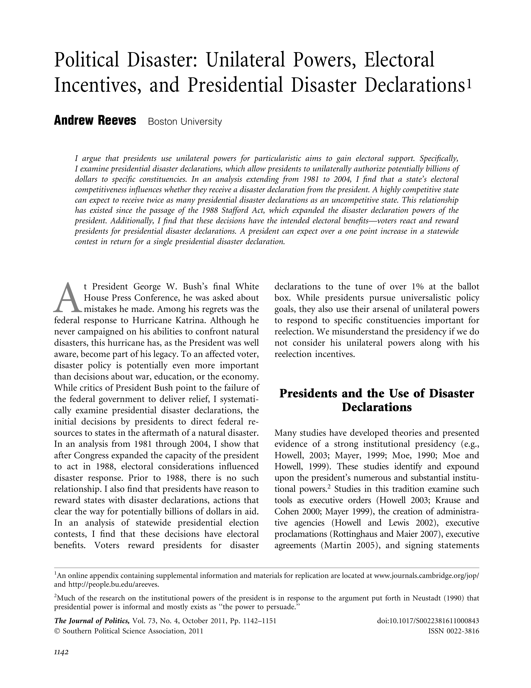

{.featured-image}

## Research Question

Do presidents use unilateral authority over disaster declarations to pursue electoral advantage?

## Main Finding

Presidents are significantly more likely to issue disaster declarations to competitive states. These actions bring electoral rewards: a single declaration can yield more than a one-point gain in statewide vote share.

## Research Design

Quantitative analysis of disaster declarations across U.S. states from 1981 to 2004, before and after the expansion of presidential authority via the 1988 Stafford Act.

## Data Employed

Archival data on presidential disaster declarations matched with electoral competitiveness and presidential vote returns.

## Substantive Importance

This paper illuminates how presidents exploit unilateral powers not only for policy but also for electoral gain. It adds to broader debates about the strategic use of institutional authority and the politicization of emergency management.

## Research Areas

Disaster Politics, Presidential Power, Swing States, Presidential Accountability, Quantitative Methods

## Citation

```bibtex
@article{fema,
  author = {Reeves, Andrew},
  title = {Political Disaster: Unilateral Powers, Electoral Incentives, and Presidential Disaster Declarations},
  journal = {Journal of Politics},
  volume = {73},
  number = {4},
  pages = {1142--1151},
  year = {2011},
}
```

## Links

- [📄 PDF](/papers/fema.pdf)
- [🎓 Google Scholar](https://scholar.google.com/scholar?q=Political%20Disaster%3A%20Unilateral%20Powers%2C%20Electoral%20Incentives%2C%20and%20Presidential%20Disaster%20Declarations)