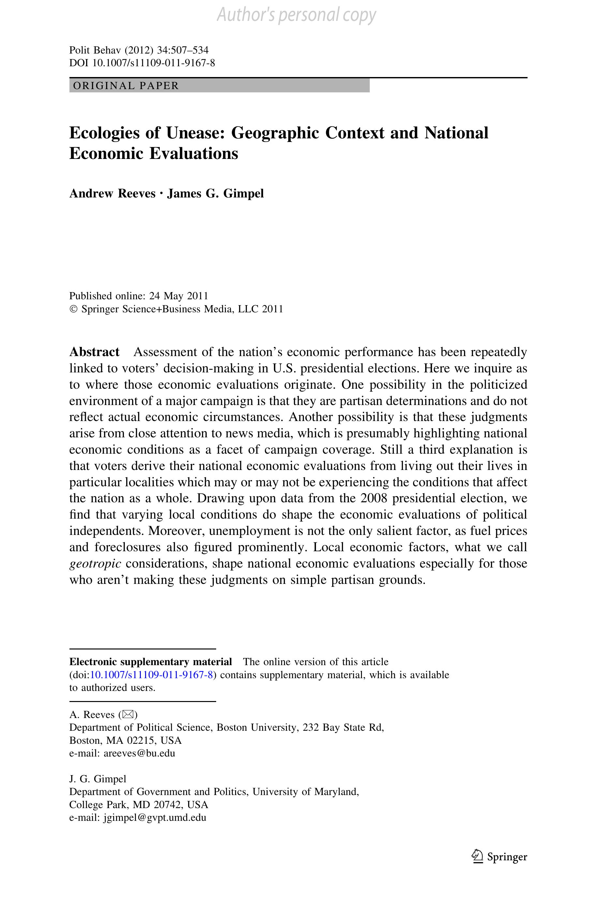

{.featured-image}

## Research Question

How do local economic conditions shape public perceptions of the national economy?

## Main Finding

Local economic indicators–-especially foreclosures, unemployment, and gas prices–-significantly influence how political independents evaluate national economic performance. These effects are particularly strong among less partisan and less politically informed voters.

## Research Design

Cross-sectional analysis of survey responses from the 2008 presidential election, matched with geographically specific economic indicators.

## Data Employed

Public opinion data merged with county- and ZIP-level statistics on unemployment, foreclosures, and fuel prices.

## Substantive Importance

The study challenges the assumption that national economic evaluations are purely sociotropic or partisan. It highlights how geographic context–-what the authors term

## Research Areas

Economic Voting, Geographic Context, Presidential Elections, County-Level Analysis, Quantitative Methods

## Citation

```bibtex
@article{foreclosures,
  author = {Reeves, Andrew and Gimpel, James G.},
  title = {Ecologies of Unease: Geographic Context and National Economic Evaluations},
  journal = {Political Behavior},
  volume = {34},
  number = {3},
  pages = {507--534},
  year = {2012},
}
```

## Links

- [📄 PDF](/papers/foreclosures.pdf)
- [🎓 Google Scholar](https://scholar.google.com/scholar?q=Ecologies%20of%20Unease%3A%20Geographic%20Context%20and%20National%20Economic%20Evaluations)