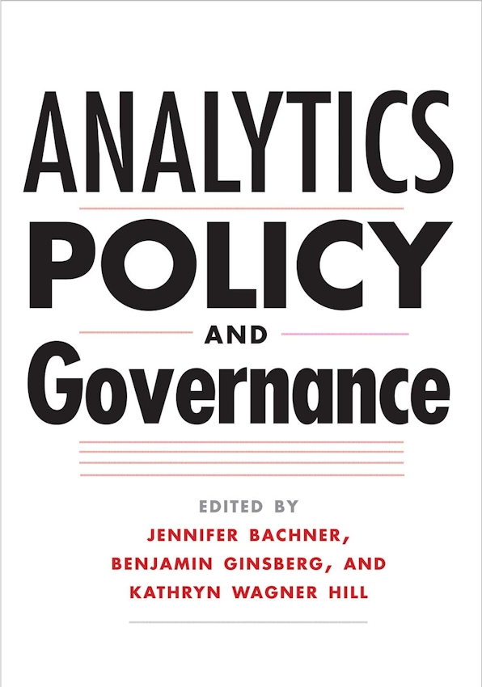

{.featured-image}

## Research Question

How can geolocation data be used to improve survey research in political science?

## Main Finding

Incorporating geolocation data allows researchers to connect individual survey responses to detailed information about respondents' communities. This linkage reveals that local context significantly shapes political attitudes, especially on issues like immigration and economic policy.

## Research Design

The paper demonstrates a novel research design that combines geolocation-enabled survey responses with external geographic data on demographics, economic conditions, and policy environments.

## Data Employed

A series of large-scale surveys collected via smartphone, which include GPS coordinates, linked to administrative and census-based geographic datasets.

## Substantive Importance

This approach enables a richer understanding of how place influences political preferences and opens new avenues for integrating behavioral data with spatial analysis in public opinion research.

## Research Areas

Research Methods, Survey Research, Geographic Context, Electoral Geography, Quantitative Methods

## Citation

```bibtex
@incollection{geolocation,
  author = {Moore, Ryan T. and Reeves, Andrew},
  title = {Learning from Place in the Era of Geolocation},
  booktitle = {Analytics, Policy and Governance},
  publisher = {Yale University Press},
  year = {2017},
}
```

## Links

- [📄 PDF](/papers/geolocation.pdf)
- [🎓 Google Scholar](https://scholar.google.com/scholar?q=Learning%20from%20Place%20in%20the%20Era%20of%20Geolocation)