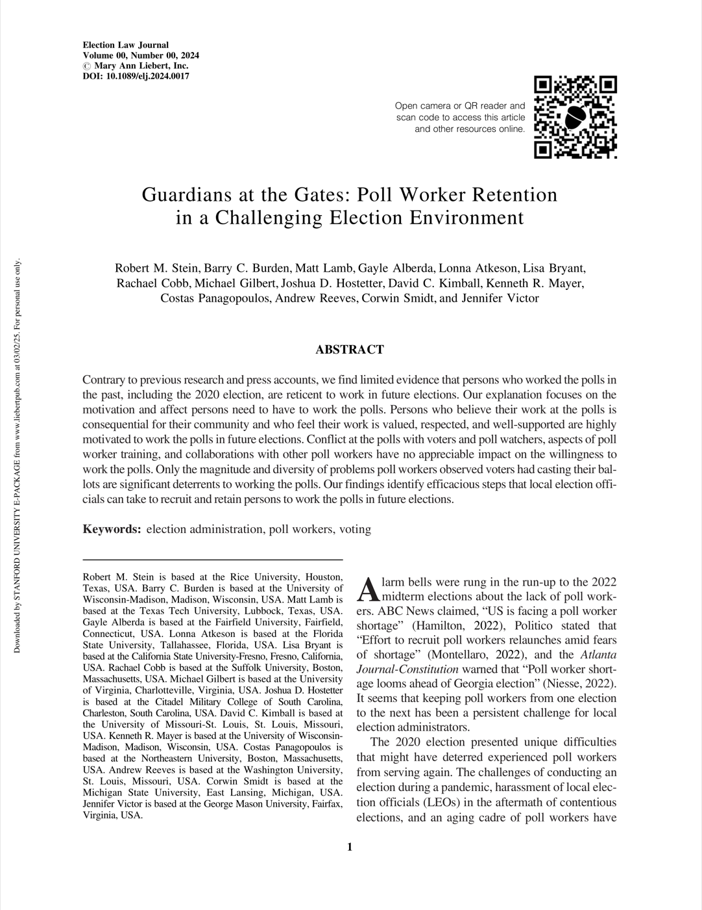

{.featured-image}

## Research Question

What factors influence whether poll workers are willing to serve again after recent high-conflict elections?

## Main Finding

Contrary to common expectations, prior poll workers are generally willing to return. Feeling that their work is consequential, valued, respected, and supported predicts retention, while voter and watcher conflict and training experiences have limited direct effects.

## Research Design

Survey-based analysis of poll workers that evaluates how motivation, support, conflict, and observed voter difficulties shape intentions to work future elections.

## Data Employed

Poll-worker survey responses measuring prior experiences, perceptions of recognition and support, exposure to conflict, and willingness to return.

## Substantive Importance

The findings identify practical levers for election administrators seeking to stabilize poll-worker capacity in challenging environments: recognition, support, and reducing voter-facing administrative problems.

## Research Areas

Election Administration, Poll Workers, Survey Research, Democratic Accountability, Local Government

## Citation

```bibtex
@article{guardians,
  author = {Robert M. Stein and Barry C. Burden and Gayle Alberda and Lonna Atkeson and Lisa Bryant and Rachel Cobb and Michael Gilbert and Josh Hostetter and David C. Kimball and Matthew Lamb and Kenneth R. Mayer and Costas Panagopoulos and Andrew Reeves and Corwin Smidt and Jennifer Victor},
  title = {Guardians at the Gates: Poll Worker Retention in a Challenging Election Environment},
  journal = {Election Law Journal},
  volume = {24},
  number = {1},
  pages = {62--73},
  year = {2025},
}
```

## Links

- [📄 PDF](../../papers/guardians.pdf)
- [🎓 Google Scholar](https://scholar.google.com/scholar?q=Guardians%20at%20the%20Gates%3A%20Poll%20Worker%20Retention%20in%20a%20Challenging%20Election%20Environment)
