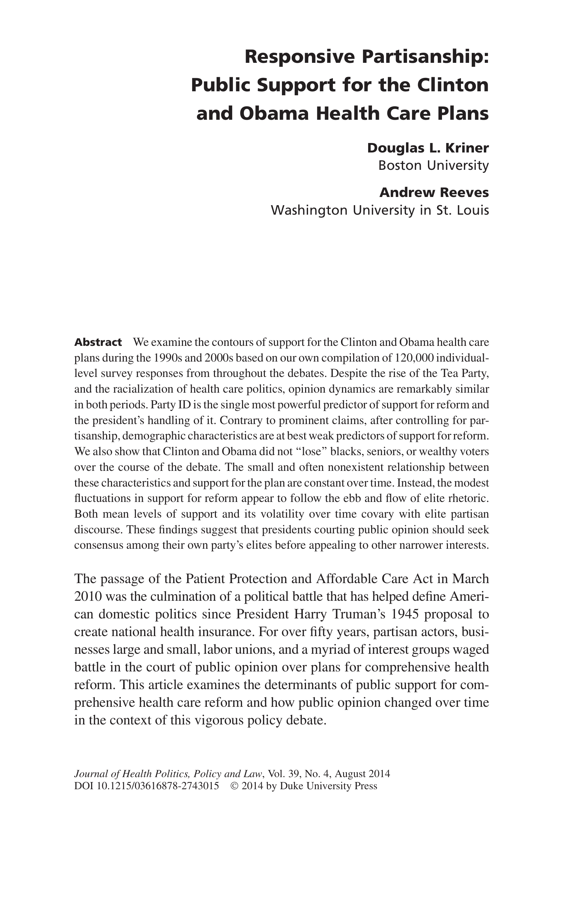

{.featured-image}

## Research Question

What explains support for the Clinton and Obama health care plans, and how did opinion change over each legislative debate?

## Main Finding

Party identification is the strongest predictor of support for both plans. After controlling for partisanship, demographic predictors are generally weak, with little evidence that Clinton or Obama "lost" seniors, Black voters, or wealthy voters over time; shifts in support track elite partisan rhetoric.

## Research Design

Individual-level analyses of support during the Clinton (1993-1994) and Obama (2009-2010) debates, combining pooled models, poll-specific estimates, and over-time analysis of elite cue environments.

## Data Employed

Approximately 120,000 responses from 126 national survey questions fielded during the two reform debates, combined with measures of elite partisan rhetoric in media coverage.

## Substantive Importance

The study shows that reform coalitions rise and fall mainly through partisan cue environments, not broad demographic realignment. It highlights the importance of elite consensus within a president's party when pursuing major social policy.

## Research Areas

Health Policy, Public Opinion, Partisanship, Elite Cues, Quantitative Methods

## Citation

```bibtex
@article{healthcare,
  author = {Kriner, Douglas L. and Reeves, Andrew},
  title = {Responsive Partisanship: Public Support for the Clinton and Obama Health Care Plans},
  journal = {Journal of Health Politics, Policy and Law},
  volume = {39},
  number = {4},
  pages = {717--749},
  year = {2014},
}
```

## Links

- [📄 PDF](../../papers/healthcare.pdf)
- [🎓 Google Scholar](https://scholar.google.com/scholar?q=Responsive%20Partisanship%3A%20Public%20Support%20for%20the%20Clinton%20and%20Obama%20Health%20Care%20Plans)
