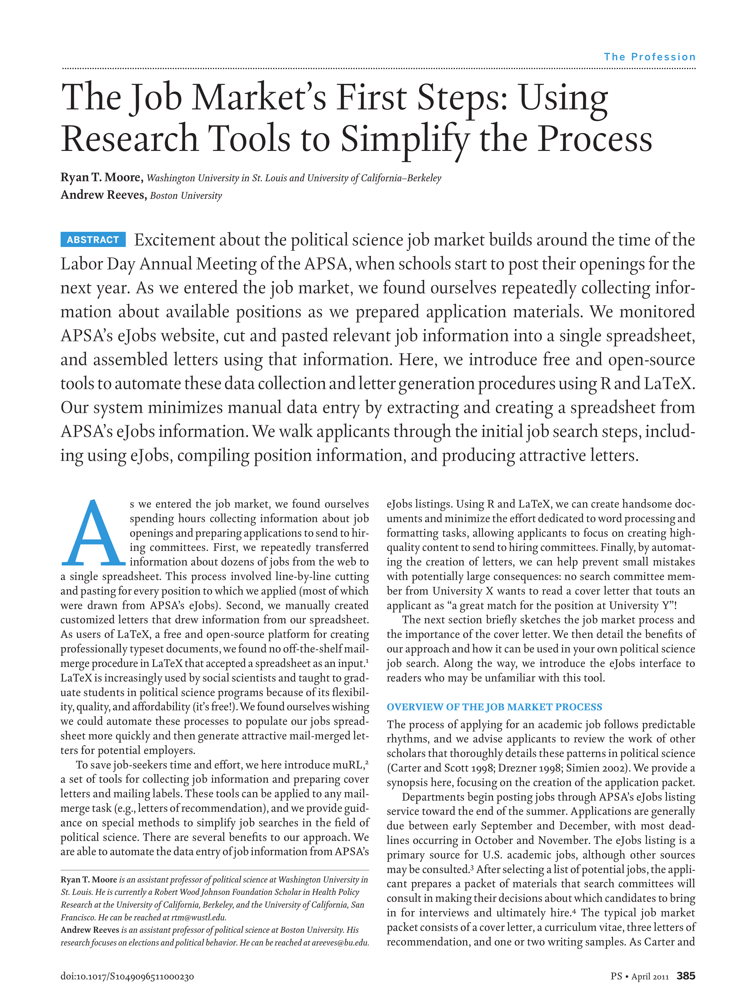

{.featured-image}

## Research Question

How do constituents respond to presidential efforts to claim credit for local economic gains, particularly job creation?

## Main Finding

Presidents often try to take credit for new jobs, but their success depends on partisan alignment and media coverage. Co-partisans are more likely to believe presidential claims, while out-partisans are skeptical or unaffected.

## Research Design

Survey experiments testing how voters react to job-related presidential credit-claiming messages under varying partisan and economic conditions.

## Data Employed

Nationally representative survey experiments embedded in online panels, paired with local economic indicators and presidential messaging cues.

## Substantive Importance

The study helps explain the limits of presidential influence on public perceptions of the economy, highlighting how partisanship mediates credit and blame in the political information environment.

## Research Areas

Presidential Accountability, Economic Voting, Partisanship, Survey Experiments, Political Communication

## Citation

```bibtex
@article{jobs,
  author = {Moore, Ryan T. and Reeves, Andrew},
  title = {The Job Market's First Steps: Using Research Tools to Simplify the Process},
  journal = {PS: Political Science and Politics},
  volume = {44},
  number = {2},
  pages = {385--391},
  year = {2011},
}
```

## Links

- [📄 PDF](/papers/jobs.pdf)
- [🎓 Google Scholar](https://scholar.google.com/scholar?q=The%20Job%20Market%27s%20First%20Steps%3A%20Using%20Research%20Tools%20to%20Simplify%20the%20Process)