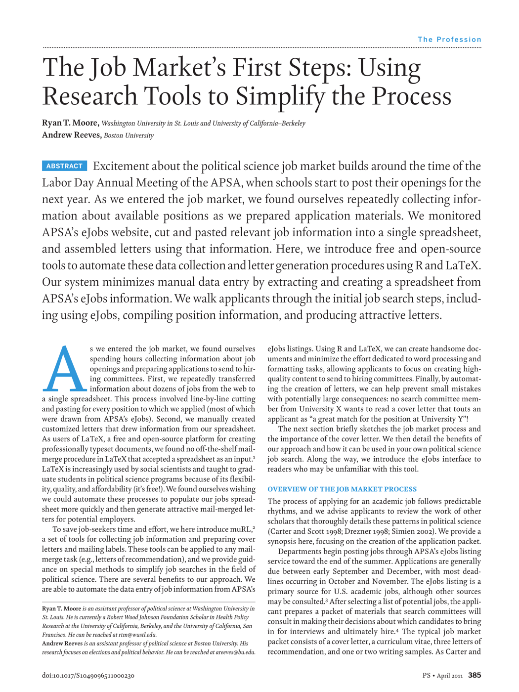

{.featured-image}

## Research Question

How can political science job candidates use research tools to reduce repetitive work in collecting listings and preparing application materials?

## Main Finding

The muRL workflow substantially reduces manual copy-paste work by automating job-listing extraction and letter production. It improves efficiency and reduces common application errors in high-volume searches.

## Research Design

Methodological tutorial presenting a practical workflow using R for scraping and spreadsheet preparation and LaTeX for mail-merge letter generation.

## Data Employed

APSA eJobs listings and structured job-application data entered into reusable spreadsheets and templates.

## Substantive Importance

The article shows how computational research tools can be repurposed for professional workflows, allowing candidates to spend more time on substantive application content.

## Research Areas

Research Methods, Professional Development, Computational Tools, Open Source, Pedagogy

## Citation

```bibtex
@article{jobs,
  author = {Moore, Ryan T. and Reeves, Andrew},
  title = {The Job Market's First Steps: Using Research Tools to Simplify the Process},
  journal = {PS: Political Science and Politics},
  volume = {44},
  number = {2},
  pages = {385--391},
  year = {2011},
}
```

## Links

- [📄 PDF](../../papers/jobs.pdf)
- [🎓 Google Scholar](https://scholar.google.com/scholar?q=The%20Job%20Market%27s%20First%20Steps%3A%20Using%20Research%20Tools%20to%20Simplify%20the%20Process)
