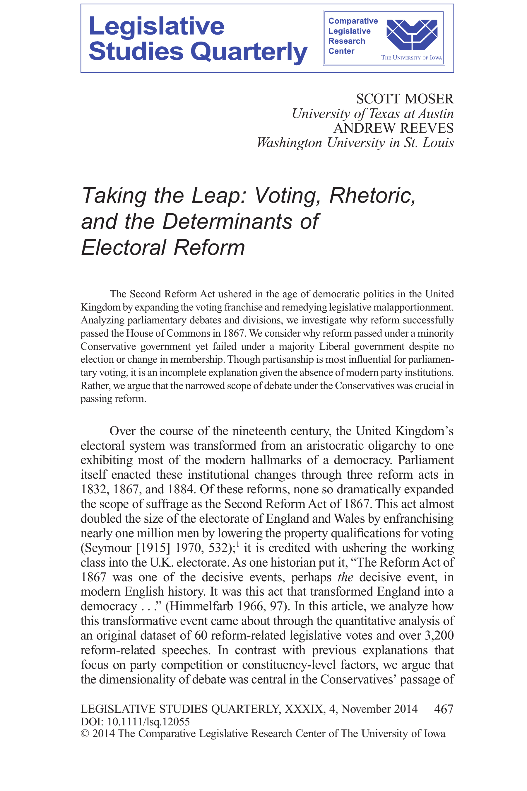

{.featured-image style="max-width: 600px; max-height: 400px; width: auto; height: auto;"}

## Research Question

How do public attitudes about government spending on disaster relief change depending on whether the aid is framed as targeted or universal?

## Main Finding

People are more supportive of disaster aid when it is framed as universal and not targeted toward specific groups. This reflects a general preference for broad-based government programs over particularistic ones.

## Research Design

Survey experiments that vary how disaster relief spending is described and identify how framing affects public support.

## Data Employed

Original nationally representative survey experiments with randomized framing of disaster aid policy scenarios.

## Substantive Importance

The findings offer insights into how public opinion can constrain or enable government responsiveness to crises, depending on perceptions of fairness and distributional equity.

## Research Areas

Legislative Behavior, Electoral Behavior, Survey Experiments, Public Opinion, Quantitative Methods

## Citation

```bibtex
@article{leap,
  author = {Moser, Scott and Reeves, Andrew},
  title = {Taking the Leap: Voting, Rhetoric, and the Determinants of Electoral Reform},
  journal = {Legislative Studies Quarterly},
  volume = {49},
  number = {4},
  pages = {467--502},
  year = {2014},
}
```

## Links

- [📄 PDF](/papers/leap.pdf)
- [🎓 Google Scholar](https://scholar.google.com/scholar?q=Taking%20the%20Leap%3A%20Voting%2C%20Rhetoric%2C%20and%20the%20Determinants%20of%20Electoral%20Reform)