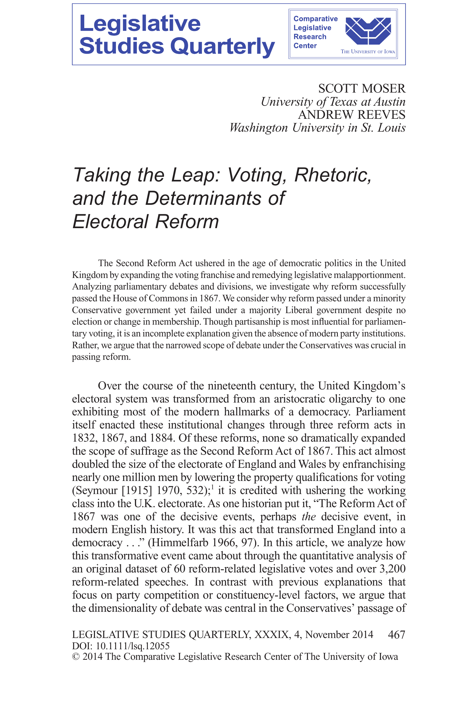

{.featured-image}

## Research Question

Why did electoral reform fail in 1866 but pass in 1867 in the same Parliament with no intervening election?

## Main Finding

Partisanship strongly structured roll-call voting, but passage depended on debate becoming more focused and less multidimensional under Conservative management. Narrowing the agenda helped assemble a winning coalition for reform.

## Research Design

Quantitative historical analysis of parliamentary divisions and speeches on reform in 1866-1867, combining vote analysis with text-based analysis of legislative rhetoric.

## Data Employed

An original dataset of 60 reform-related parliamentary votes and more than 3,200 reform-related speeches from Commons debates.

## Substantive Importance

The paper clarifies how major institutional reform can hinge on agenda structure and debate dimensionality, not only party seat counts, in weakly institutionalized party systems.

## Research Areas

Legislative Politics, Electoral Reform, Historical Political Economy, Text Analysis, Quantitative Methods

## Citation

```bibtex
@article{leap,
  author = {Moser, Scott and Reeves, Andrew},
  title = {Taking the Leap: Voting, Rhetoric, and the Determinants of Electoral Reform},
  journal = {Legislative Studies Quarterly},
  volume = {49},
  number = {4},
  pages = {467--502},
  year = {2014},
}
```

## Links

- [📄 PDF](../../papers/leap.pdf)
- [🎓 Google Scholar](https://scholar.google.com/scholar?q=Taking%20the%20Leap%3A%20Voting%2C%20Rhetoric%2C%20and%20the%20Determinants%20of%20Electoral%20Reform)
