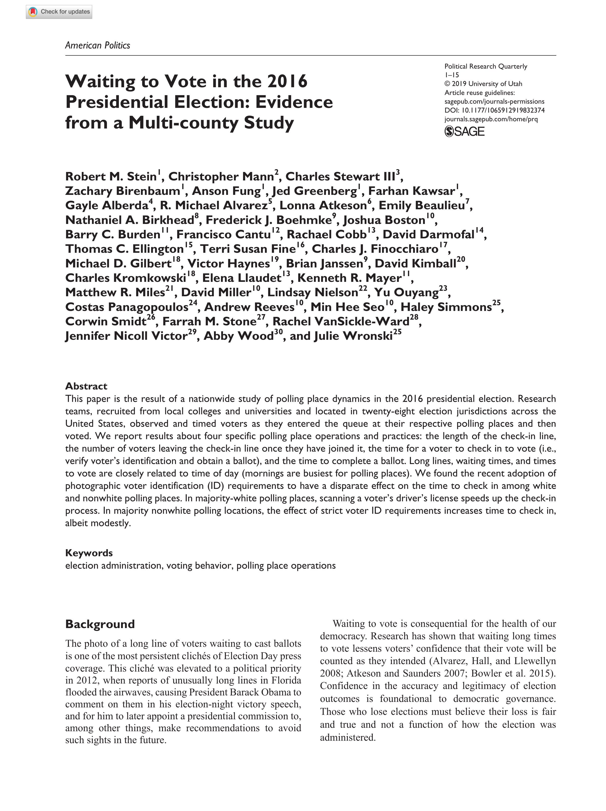

{.featured-image style="max-width: 600px; max-height: 400px; width: auto; height: auto;"}

## Research Question

How do polling place lines affect voter experience, confidence, and trust in the electoral process?

## Main Finding

Long lines at polling places reduce voter confidence in the fairness and efficiency of elections. These effects are strongest among voters who experience delays and among historically marginalized groups.

## Research Design

Original survey research assessing voter experiences with polling lines and their relationship to confidence in the electoral process.

## Data Employed

Post-election surveys capturing self-reported wait times, demographic information, and evaluations of election administration.

## Substantive Importance

The study demonstrates how seemingly minor administrative barriers like wait times can erode trust in democratic institutions. It provides evidence for reforms aimed at improving access and equity in election administration.

## Research Areas

Election Administration, Electoral Behavior, Survey Research, Democratic Accountability, Field Research

## Citation

```bibtex
@article{lines,
  author = {Stein, Robert and Birenbaum, Zachary and Kawsar, Farhan and III, Charles Stewart and Alberda, Gayle and Alvarez, R. Michael and Beaulieu, Emily and Birkhead, Nathaniel A. and Boehmke, Frederick and Boston, Joshua and Burden, Barry C. and Cantu, Francisco and Cobb, Rachael and Darmofal, David and Ellington, Thomas C. and Finocchiaro, Charles J. and Gilbert, Michael and Haynes, Victor and Janssen, Brian and Kimball, David and Kromkowski, Charles and Llaudet, Elena and Mann, Christopher and Mayer, Ken and Miles, Matthew R. and Miller, David and Nielson, Lindsay and Ouyang, Yu and Panagopoulos, Costas and Reeves, Andrew and Seo, Min Hee and Smidt, Corwin and VanSickle-Ward, Rachel and Wood, Abby and Wronski, Julie},
  title = {Waiting to Vote in the 2016 Presidential Election: Evidence from a Multi-Campus Study},
  journal = {Political Research Quarterly},
  volume = {73},
  number = {2},
  pages = {439--453},
  year = {2020},
}
```

## Links

- [📄 PDF](/papers/lines.pdf)
- [🏛️ Publisher](https://journals.sagepub.com/doi/abs/10.1177/1065912919832374)
- [🎓 Google Scholar](https://scholar.google.com/scholar?q=Waiting%20to%20Vote%20in%20the%202016%20Presidential%20Election%3A%20Evidence%20from%20a%20Multi-Campus%20Study)