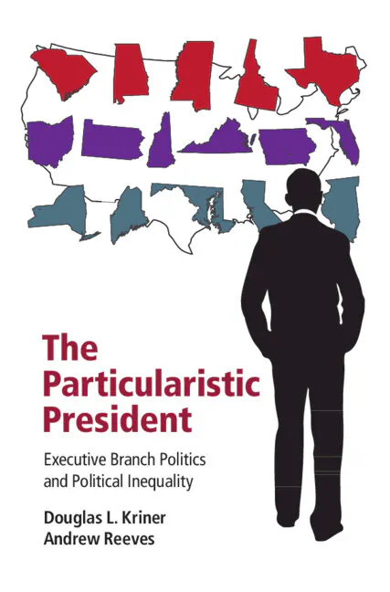

{.featured-image}

## Research Question

Do presidents govern in a universalistic way to serve the national interest, or do they systematically favor politically advantageous constituencies in the distribution of federal resources?

## Main Finding

Presidents consistently behave in a particularistic manner, directing federal spending and administrative attention to swing states and core partisan areas. Rather than acting as neutral national leaders, they exploit executive control over the bureaucracy to serve political goals.

## Research Design

The book employs a multi-method approach that includes large-N statistical analyses of federal spending patterns, paired with in-depth case studies of executive branch decision-making and bureaucratic responsiveness to presidential incentives.

## Data Employed

The authors analyze decades of data on federal grants, disaster declarations, procurement contracts, and agency rulemaking, matched to political variables such as state partisanship, electoral competitiveness, and presidential vote margins.

## Substantive Importance

This book reframes the presidency as a source of political inequality, demonstrating how modern presidents use their institutional tools not to represent the entire nation, but to advantage key constituencies. It challenges prevailing normative assumptions about executive leadership and raises fundamental questions about fairness, accountability, and the democratic role of the presidency.

## Research Areas

Presidential Particularism, Distributive Politics, Presidential Power, Democratic Accountability, Quantitative Methods

## Citation

```bibtex
@book{partpres,
  author = {Kriner, Douglas L. and Reeves, Andrew},
  title = {The Particularistic President: Executive Branch Politics and Political Inequality},
  publisher = {Cambridge University Press},
  year = {2015},
}
```

## Links

- [📄 PDF](/papers/partpres.pdf)
- [🏛️ Publisher](https://www.cambridge.org/core/books/particularistic-president/1C2686B436BCBFAB3D46EDBD7C2A17C3)
- [🎓 Google Scholar](https://scholar.google.com/scholar?q=The%20Particularistic%20President%3A%20Executive%20Branch%20Politics%20and%20Political%20Inequality)