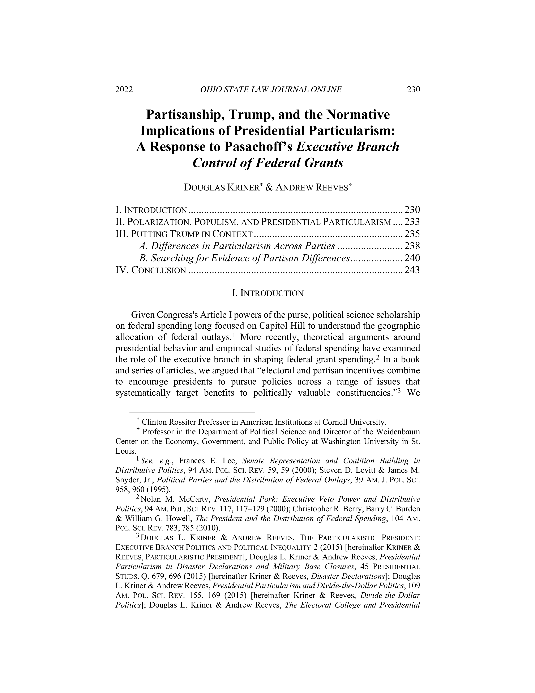

{.featured-image style="max-width: 600px; max-height: 400px; width: auto; height: auto;"}

## Research Question

What are the broader implications of presidential particularism, and how does it relate to populism and executive branch governance?

## Main Finding

The authors defend and extend their theory of presidential particularism in response to critique. They argue that particularistic policymaking is a persistent and central feature of executive governance, not a marginal or exceptional behavior.

## Research Design

This is a conceptual reply that synthesizes normative and empirical arguments, responding to legal scholarship and expanding the theoretical implications of prior findings.

## Data Employed

The paper draws on previously published empirical studies of presidential behavior, federal spending, and administrative discretion.

## Substantive Importance

The reply sharpens the normative critique of presidential governance and stresses how particularism can undermine equal protection and public trust. It contributes to interdisciplinary debates on executive power and the rule of law.

## Research Areas

Presidential Particularism, Presidential Power, Democratic Accountability, Normative Theory, Legal Scholarship

## Citation

```bibtex
@article{pasachoff-reply,
  author = {Kriner, Douglas and Reeves, Andrew},
  title = {Partisanship, Trump, and the Normative Implications of Presidential Particularism: A Response to Pasachoff's Executive Branch Control of Federal Grants},
  journal = {Ohio State Law Journal Online},
  volume = {83},
  pages = {230--246},
  year = {2022},
}
```

## Links

- [📄 PDF](/papers/pasachoff-reply.pdf)
- [🎓 Google Scholar](https://scholar.google.com/scholar?q=Partisanship%2C%20Trump%2C%20and%20the%20Normative%20Implications%20of%20Presidential%20Particularism%3A%20A%20Response%20to%20Pasachoff%27s%20Executive%20Branch%20Control%20of%20Federal%20Grants)