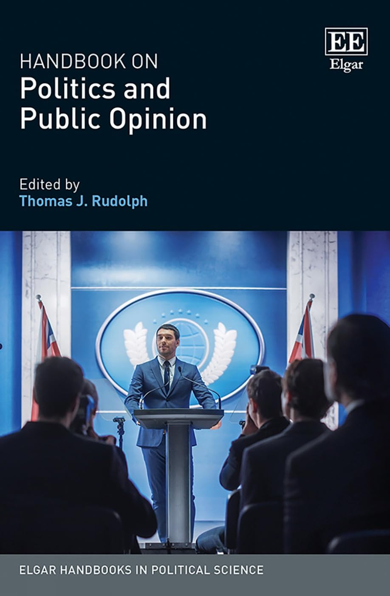

{.featured-image style="max-width: 600px; max-height: 400px; width: auto; height: auto;"}

## Research Question

How do geographic factors and spatial context shape public opinion and political behavior?

## Main Finding

Geographic context systematically influences political attitudes and behaviors, beyond individual traits. Local composition, proximity to others, and community characteristics are central to understanding public opinion and electoral outcomes.

## Research Design

This is a synthetic review essay that integrates findings from political science, sociology, and geography to evaluate how place affects politics.

## Data Employed

The paper synthesizes empirical work using survey data, spatial analysis, and multilevel models across various studies of political behavior and geography.

## Substantive Importance

This work highlights how political inequality is shaped not just by who people are, but where they live. It provides a framework for understanding polarization, representation, and spatial segregation in American politics.

## Research Areas

Electoral Geography, Public Opinion, Electoral Behavior, Geographic Context, Literature Review

## Citation

```bibtex
@incollection{political-geography,
  author = {Gimpel, James G. and Reeves, Andrew},
  title = {Electoral Geography, Political Behavior and Public Opinion},
  booktitle = {Handbook on Politics and Public Opinion},
  publisher = {Edward Elgar Publishing},
  year = {2022},
}
```

## Links

- [📄 PDF](/papers/political-geography.pdf)
- [🎓 Google Scholar](https://scholar.google.com/scholar?q=Electoral%20Geography%2C%20Political%20Behavior%20and%20Public%20Opinion)