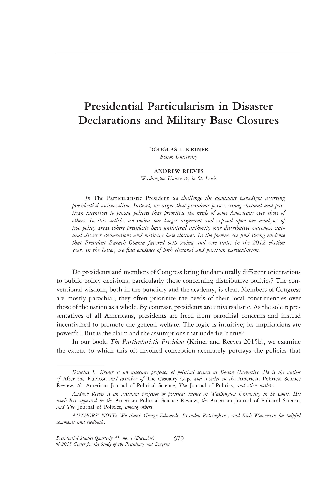

{.featured-image}

## Research Question

Do presidents reflect national interests in distributing federal aid, or do they favor their partisan base?

## Main Finding

Presidents disproportionately direct federal aid to counties with co-partisan governors, particularly during election years. This pattern holds across both Democratic and Republican administrations, suggesting a systematic partisan logic in executive resource allocation.

## Research Design

Panel regression models of county-level FEMA disaster aid from 1996 to 2011, with interaction terms capturing the presence of co-partisan governors and electoral timing.

## Data Employed

FEMA public assistance records, gubernatorial partisanship data, county-level political and demographic controls, and presidential election timing.

## Substantive Importance

The findings reveal a hidden form of executive particularism that operates through federal-state cooperation. They suggest presidents use intergovernmental tools to serve political ends, raising concerns about the politicization of emergency management.

## Research Areas

Presidential Particularism, Disaster Politics, Partisanship, Intergovernmental Relations, County-Level Analysis

## Citation

```bibtex
@article{prespart,
  author = {Kriner, Douglas L. and Reeves, Andrew},
  title = {Presidential Particularism in Disaster Declarations and Military Base Closures},
  journal = {Presidential Studies Quarterly},
  volume = {45},
  number = {4},
  pages = {679--702},
  year = {2015},
}
```

## Links

- [📄 PDF](/papers/prespart.pdf)
- [🎓 Google Scholar](https://scholar.google.com/scholar?q=Presidential%20Particularism%20in%20Disaster%20Declarations%20and%20Military%20Base%20Closures)