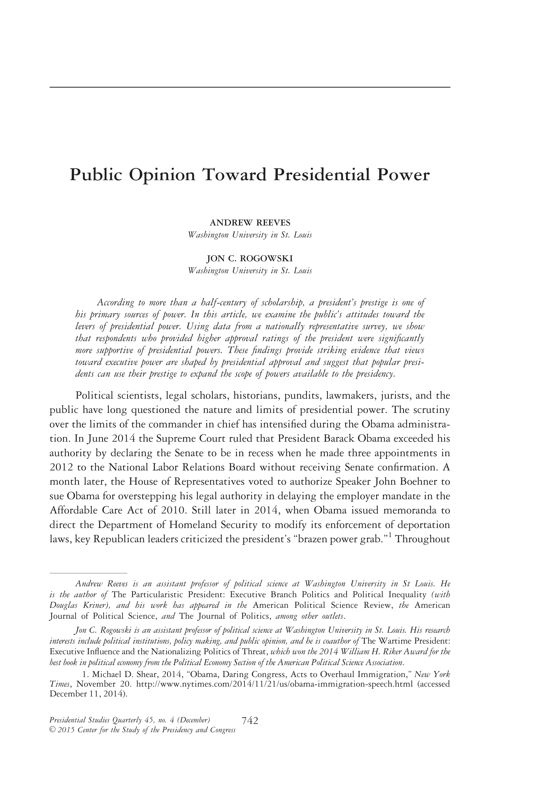

{.featured-image}

## Research Question

What constrains or enables presidential unilateral action, and how do institutions and public opinion influence executive policymaking?

## Main Finding

Presidents are more likely to act unilaterally when public support is high and when institutional checks–-such as congressional opposition–-are weak or fragmented. The study finds that political conditions, not legal constraints, are the dominant factors in presidential decision-making.

## Research Design

A formal theoretical model of executive action combined with empirical testing using time-series cross-sectional data on unilateral orders.

## Data Employed

Executive orders and proclamations from 1945 to 2006, linked with measures of public approval, congressional composition, and political polarization.

## Substantive Importance

The paper helps reframe debates over executive power by emphasizing political incentives and constraints. It contributes to broader discussions about democratic accountability and the strategic nature of presidential governance.

## Research Areas

Presidential Power, Public Opinion, Institutional Constraints, Democratic Accountability, Formal Theory

## Citation

```bibtex
@article{prespower,
  author = {Reeves, Andrew and Rogowski, Jon C.},
  title = {Public Opinion toward Presidential Power},
  journal = {Presidential Studies Quarterly},
  volume = {45},
  number = {4},
  pages = {742--759},
  year = {2015},
}
```

## Links

- [📄 PDF](/papers/prespower.pdf)
- [🎓 Google Scholar](https://scholar.google.com/scholar?q=Public%20Opinion%20toward%20Presidential%20Power)