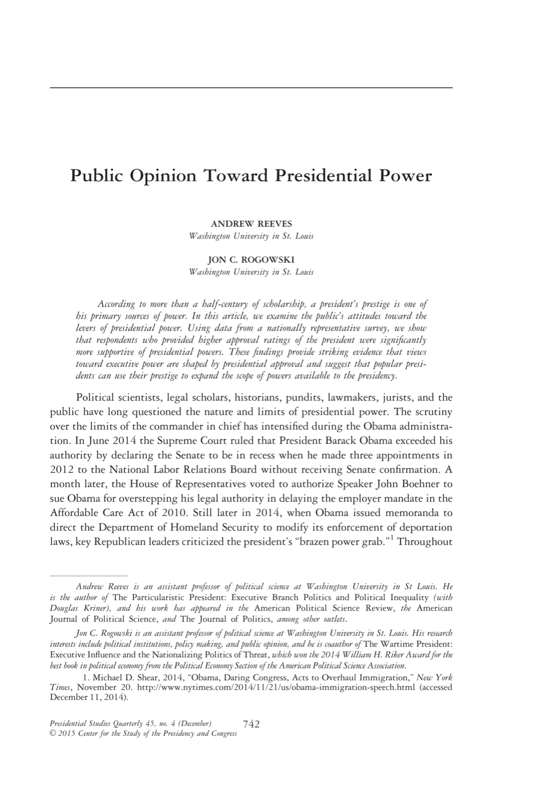

{.featured-image}

## Research Question

How does approval of the incumbent president shape mass support for institutional presidential powers?

## Main Finding

Respondents who approve of the president are significantly more supportive of presidential powers. This link suggests that political prestige can expand the range of authority citizens are willing to grant the executive.

## Research Design

Analysis of nationally representative survey data on support for specific presidential powers and evaluations of incumbent performance.

## Data Employed

National survey responses measuring presidential approval and attitudes toward multiple presidential power instruments.

## Substantive Importance

The study shows that support for executive power is not fixed; it varies with who holds office. This dynamic has implications for democratic guardrails when popular presidents seek broader authority.

## Research Areas

Presidential Power, Public Opinion, Presidential Approval, Democratic Accountability, Survey Research

## Citation

```bibtex
@article{prespower,
  author = {Reeves, Andrew and Rogowski, Jon C.},
  title = {Public Opinion toward Presidential Power},
  journal = {Presidential Studies Quarterly},
  volume = {45},
  number = {4},
  pages = {742--759},
  year = {2015},
}
```

## Links

- [📄 PDF](../../papers/prespower.pdf)
- [🎓 Google Scholar](https://scholar.google.com/scholar?q=Public%20Opinion%20toward%20Presidential%20Power)
