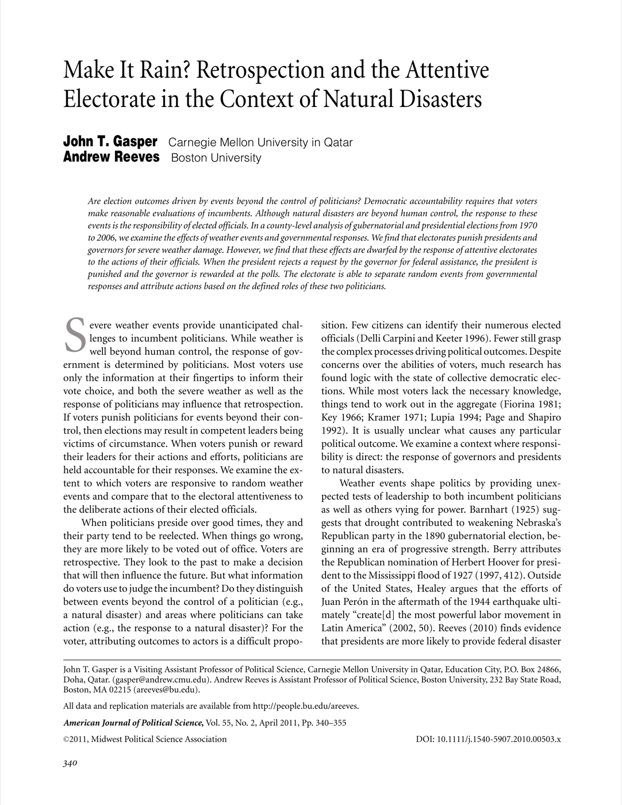

{.featured-image}

## Research Question

Do voters punish leaders for natural disasters, and can they distinguish uncontrollable events from the choices presidents and governors make in response?

## Main Finding

Electorates punish incumbents for severe weather, but these effects are smaller than voter responses to official behavior. When governors request aid and presidents deny it, presidents are punished while governors are rewarded.

## Research Design

County-level analysis of gubernatorial and presidential elections from 1970 to 2006, estimating effects of weather damage and disaster-response decisions.

## Data Employed

County-level election returns, severe-weather damage data, and records on disaster declaration requests, approvals, and denials.

## Substantive Importance

The study shows that democratic accountability can be more discerning than simple blind retrospection: voters respond to both outcomes and institutional responsibility for response decisions.

## Research Areas

Disaster Politics, Presidential Accountability, Retrospective Voting, County-Level Analysis, Distributive Politics

## Citation

```bibtex
@article{rain,
  author = {Gasper, John T. and Reeves, Andrew},
  title = {Make it Rain? Retrospection and the Attentive Electorate in the Context of Natural Disasters},
  journal = {American Journal of Political Science},
  volume = {55},
  number = {2},
  pages = {340--355},
  year = {2011},
}
```

## Links

- [📄 PDF](../../papers/rain.pdf)
- [🎓 Google Scholar](https://scholar.google.com/scholar?q=Make%20it%20Rain%3F%20Retrospection%20and%20the%20Attentive%20Electorate%20in%20the%20Context%20of%20Natural%20Disasters)
