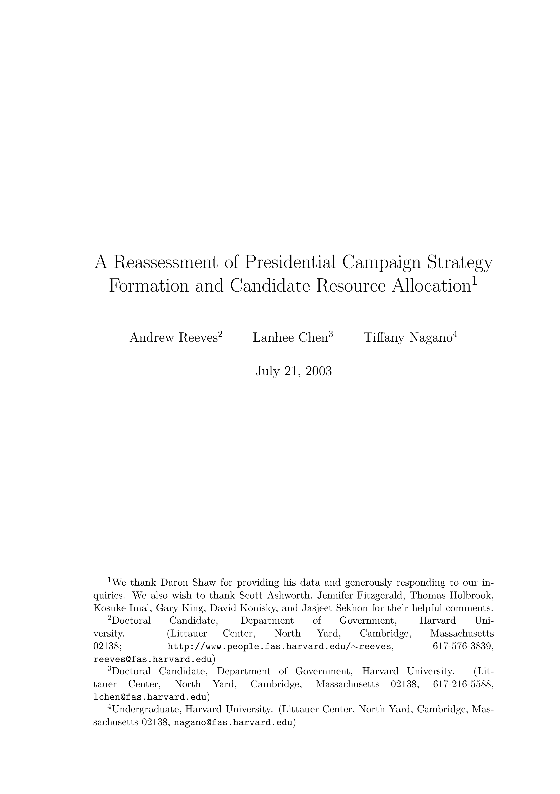

{.featured-image style="max-width: 600px; max-height: 400px; width: auto; height: auto;"}

## Research Question

How should we assess the effectiveness of the American presidency, and what metrics capture success beyond short-term approval or policy wins?

## Main Finding

The authors argue for a broader reassessment of presidential effectiveness that includes institutional leadership, long-term policy change, and normative considerations. They caution against over-reliance on popularity or legislative tallies as measures of presidential success.

## Research Design

A conceptual and historical reassessment drawing on presidential case studies and existing theories of executive leadership.

## Data Employed

Historical case examples from multiple presidencies, used illustratively to support normative and institutional arguments.

## Substantive Importance

This work encourages scholars and citizens to evaluate presidents in terms of democratic values, institutional stewardship, and enduring impact–-not just short-term wins. It reframes how presidential greatness and failure are understood.

## Research Areas

Campaign Strategy, Presidential Elections, Institutional Design, Normative Theory, Democratic Accountability

## Citation

```bibtex
@article{reassessment-long,
  author = {Reeves, Andrew and Chen, Lanhee J. and Nagano, Tiffany},
  title = {{A Reassessment of Presidential Campaign Strategy Formation and Candidate Resource Allocation}},
  volume = {Typescript},
  year = {2003},
}
```

## Links

- [📄 PDF](/papers/reassessment-long.pdf)
- [🎓 Google Scholar](https://scholar.google.com/scholar?q=A%20Reassessment%20of%20Presidential%20Campaign%20Strategy%20Formation%20and%20Candidate%20Resource%20Allocation)