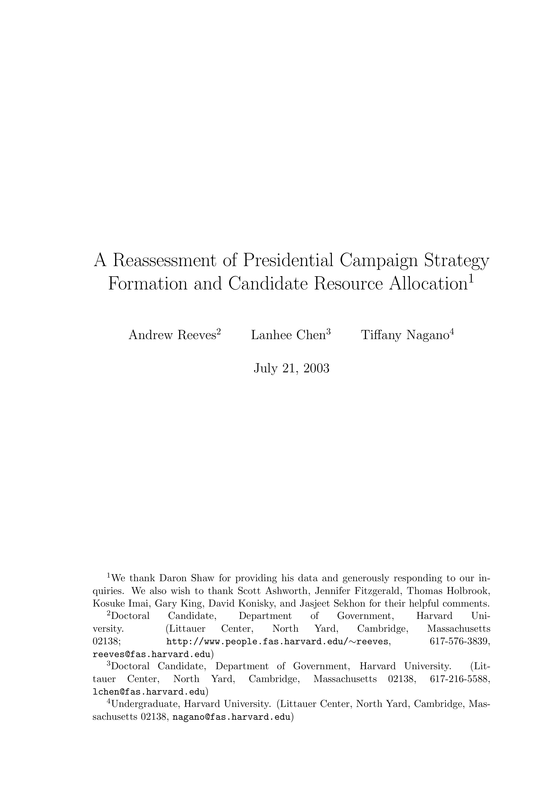

{.featured-image}

## Research Question

Do classic claims about how presidential campaigns form Electoral College strategy and allocate resources survive replication with the correct methods?

## Main Finding

When the models are correctly implemented, key substantive conclusions from the original study disappear. Predictors of strategy formation and strategy effects on resource allocation are no longer robust.

## Research Design

Methodological replication and reanalysis of a widely cited campaign-strategy study, with direct comparison between reported and correctly estimated models.

## Data Employed

State-level campaign-strategy and allocation data from presidential elections (1988-1996), re-estimated using the methods claimed in the original article.

## Substantive Importance

The paper demonstrates the importance of replication and model transparency in cumulative social science, especially when influential findings shape broader literatures.

## Research Areas

Campaign Strategy, Presidential Elections, Replication, Quantitative Methods, Research Transparency

## Citation

```bibtex
@article{reassessment-long,
  author = {Reeves, Andrew and Chen, Lanhee J. and Nagano, Tiffany},
  title = {{A Reassessment of Presidential Campaign Strategy Formation and Candidate Resource Allocation}},
  volume = {Typescript},
  year = {2003},
}
```

## Links

- [📄 PDF](../../papers/reassessment-long.pdf)
- [🎓 Google Scholar](https://scholar.google.com/scholar?q=A%20Reassessment%20of%20Presidential%20Campaign%20Strategy%20Formation%20and%20Candidate%20Resource%20Allocation)
