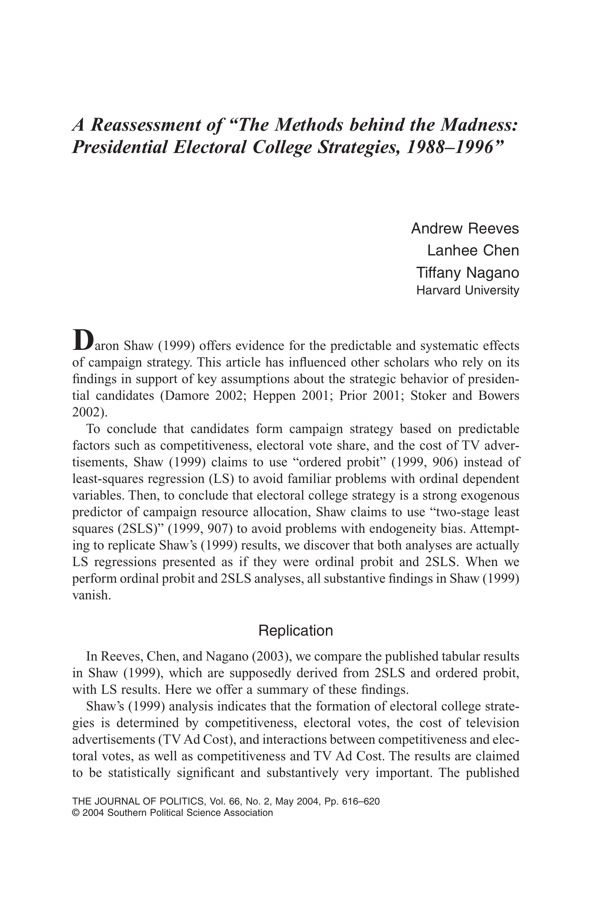

{.featured-image}

## Research Areas

Campaign Strategy, Presidential Elections, Electoral Behavior, Quantitative Methods

## Citation

```bibtex
@article{reassessment,
  author = {Reeves, Andrew and Chen, Lanhee and Nagano, Tiffany},
  title = {A Reassessment of `The Methods behind the Madness: Presidential Electoral College Strategies, 1988--1996'},
  journal = {Journal of Politics},
  volume = {66},
  number = {2},
  pages = {616--620},
  year = {2004},
}
```

## Links

- [📄 PDF](/papers/reassessment.pdf)
- [🎓 Google Scholar](https://scholar.google.com/scholar?q=A%20Reassessment%20of%20%60The%20Methods%20behind%20the%20Madness%3A%20Presidential%20Electoral%20College%20Strategies%2C%201988%E2%80%931996%27)