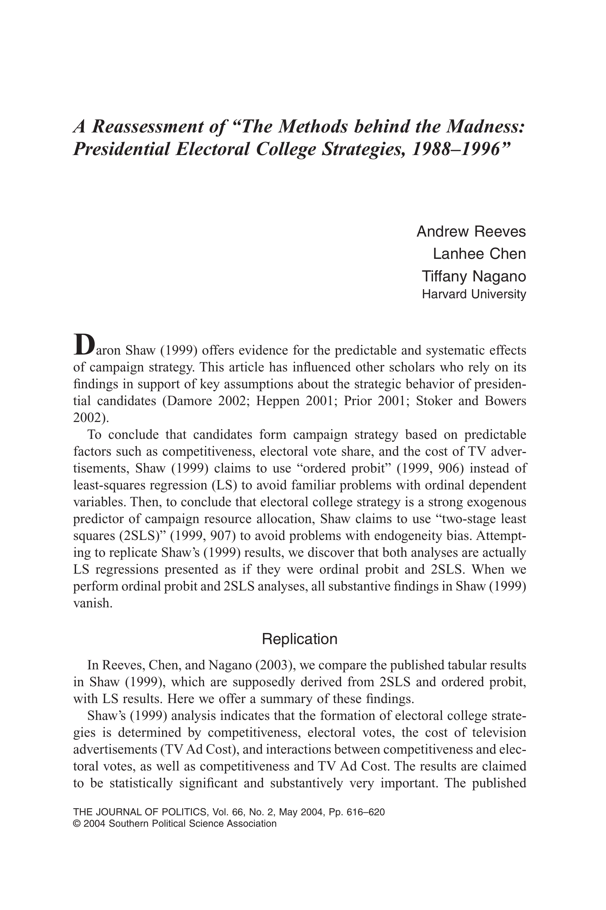

{.featured-image}

## Research Question

Do influential claims about presidential Electoral College strategy remain valid when the original analysis is correctly specified and replicated?

## Main Finding

The reassessment finds major methodological errors in the original study's reported models. When appropriate methods are applied, the central substantive claims about campaign strategy formation and resource allocation no longer hold.

## Research Design

Replication audit and methodological reanalysis of previously published campaign strategy models.

## Data Employed

The original 1988-1996 state-level campaign strategy and campaign resource data, re-estimated using ordered probit and alternative instrumental-variable specifications.

## Substantive Importance

The article illustrates how fragile headline findings can be when model choice and estimation are misreported. It provides a concrete case for replication, transparency, and methodologically defensible inference in electoral research.

## Research Areas

Campaign Strategy, Presidential Elections, Electoral Behavior, Quantitative Methods

## Citation

```bibtex
@article{reassessment,
  author = {Reeves, Andrew and Chen, Lanhee and Nagano, Tiffany},
  title = {A Reassessment of `The Methods behind the Madness: Presidential Electoral College Strategies, 1988--1996'},
  journal = {Journal of Politics},
  volume = {66},
  number = {2},
  pages = {616--620},
  year = {2004},
}
```

## Links

- [📄 PDF](../../papers/reassessment.pdf)
- [🎓 Google Scholar](https://scholar.google.com/scholar?q=A%20Reassessment%20of%20%60The%20Methods%20behind%20the%20Madness%3A%20Presidential%20Electoral%20College%20Strategies%2C%201988%E2%80%931996%27)
