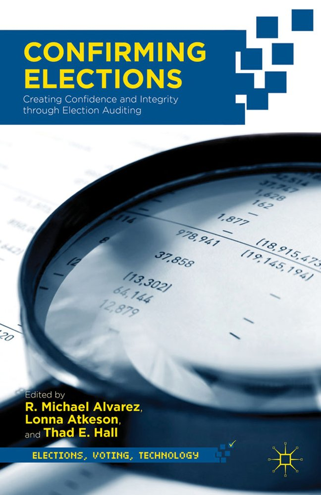

{.featured-image style="max-width: 600px; max-height: 400px; width: auto; height: auto;"}

## Research Question

How accurate are different vote tabulation methods, and do modern voting machines improve accuracy compared to traditional hand-counted paper ballots?

## Main Finding

Optical scanning machines demonstrate superior accuracy compared to hand-counted paper ballots. The tabulation error rate for optically scanned ballots was approximately 0.56%, compared to 0.87% for hand-counted paper ballots (excluding outliers). This represents roughly a 50% improvement in tabulation accuracy with machine counting.

## Research Design

The study employs a "tabulation validation rate" methodology, comparing initial vote counts with recount results to measure accuracy. The analysis includes both historical data (1946-1962) to establish baselines for hand counting, and contemporary data (2002) to compare hand counting with optical scanning technology. Regression analysis controls for office type, community size, and initial vote totals.

## Data Employed

Historical recount data from New Hampshire elections spanning 1946-2002, including 415 cases from the historical period (all hand-counted) and 306 cases from 2002 (comparing hand-counted vs. optically scanned ballots). The dataset covers various offices from local races to Congressional contests across multiple New Hampshire towns and districts.

## Substantive Importance

This research provides empirical evidence that voting technology modernization has indeed improved election accuracy, contrary to concerns raised after the 2000 Florida recount. The findings have direct implications for election administration policy, suggesting that automatic recount thresholds should consider technology-specific error rates and that continued investment in optical scanning technology is justified by measurable improvements in vote tabulation accuracy.

## Research Areas

Election Administration, Election Integrity, Voting Technology, Quantitative Methods

## Citation

```bibtex
@incollection{recounts,
  author = {Ansolabehere, Stephen D. and Reeves, Andrew},
  title = {Using Recounts to Measure the Accuracy of Vote Tabulations: Evidence from New Hampshire Elections 1946-2002},
  booktitle = {Confirming Elections: Creating Confidence and Integrity through Election Auditing},
  publisher = {Palgrave Macmillan},
  year = {2012},
}
```

## Links

- [📄 PDF](/papers/recounts.pdf)
- [🎓 Google Scholar](https://scholar.google.com/scholar?q=Using%20Recounts%20to%20Measure%20the%20Accuracy%20of%20Vote%20Tabulations%3A%20Evidence%20from%20New%20Hampshire%20Elections%201946-2002)