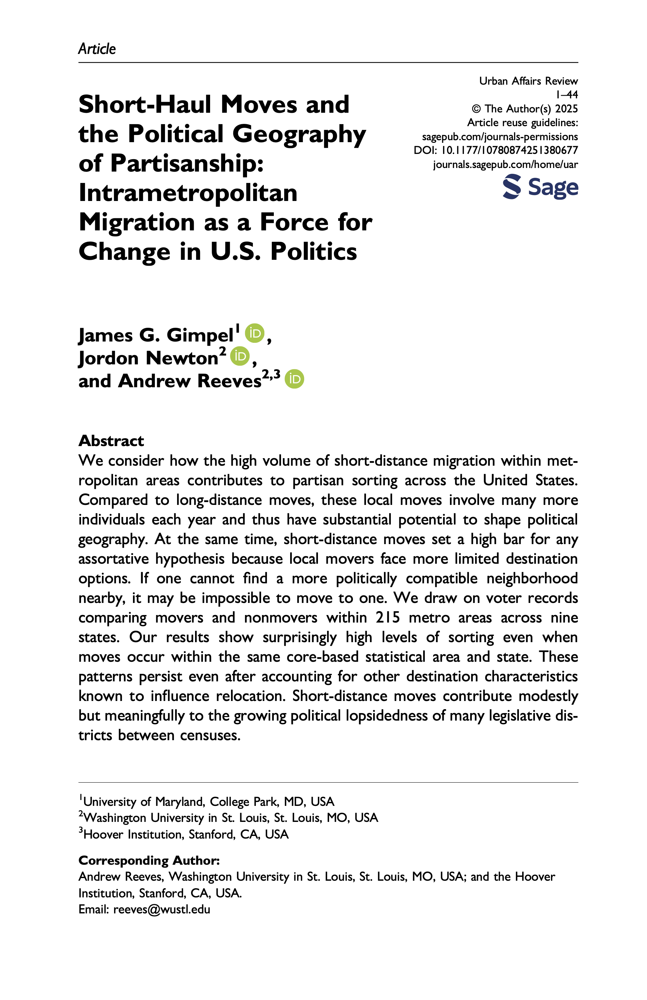

{.featured-image}

## Research Question

Does short-distance residential mobility within metropolitan areas contribute to partisan sorting? Specifically, do local movers relocate to neighborhoods that better match their partisan identity, even when destination options are geographically constrained?

## Main Finding

Short-distance movers sort into more politically compatible neighborhoods, even when relocating only within the same metro area. Democrats move to slightly more Democratic areas and Republicans move to slightly more Republican ones. These effects are modest but persistent across scales of geography. Nonmovers experience far smaller partisan shifts in their surroundings, confirming that mobility—not secular change—is the primary engine of local partisan polarization.

## Research Design

An observational analysis of nearly 32.3 million registered voters across 215 metropolitan areas in nine states, comparing movers and nonmovers matched in voter files from 2012 and 2020. The design estimates changes in partisan context across block groups, census tracts, and zip codes, using fixed-effects models and demographic controls to examine how relocation alters the partisan balance of destinations relative to origins.

## Data Employed

Voter file records from California, Colorado, Connecticut, Florida, Iowa, North Carolina, Oregon, Pennsylvania, and Utah. The dataset includes complete addresses, party registration, and demographic variables. Movement is identified by changes in zip codes between 2012 and 2020. The analysis incorporates local demographic characteristics (race, income, education, population density) at multiple geographic scales.

## Substantive Importance

The study shows that even very short-haul mobility—moves within the same labor and housing markets—incrementally deepens geographic partisan polarization. These local moves modestly but meaningfully reshape the political composition of neighborhoods and, over time, the partisan balance of legislative districts. The findings illuminate how everyday residential decisions contribute to the long-term restructuring of political geography, helping explain the increasingly lopsided partisan landscape observed across metro America.

## Research Areas

Political Geography, Partisan Sorting, Migration and Mobility, Local Political Change, Electoral Behavior

## Citation

```bibtex
@article{shorthaul,
  author = {Gimpel, James G. and Newton, Jordon and Reeves, Andrew},
  title = {Short-Haul Moves and the Political Geography of Partisanship: Intrametropolitan Migration as a Force for Change in U.S. Politics},
  journal = {Urban Affairs Review},
  year = {2025},
  note = {Advance online publication},
  pages = {1--44},
  doi = {10.1177/10780874251380677}
}

```

## Links

- [📄 PDF](../../papers/shorthaul.pdf)
- [🎓 Google Scholar](https://scholar.google.com/scholar?q=Short-Haul%20Moves%20and%20the%20Political%20Geography%20of%20Partisanship%3A%20Intrametropolitan%20Migration%20as%20a%20Force%20for%20Change%20in%20U.S.%20Politics)
