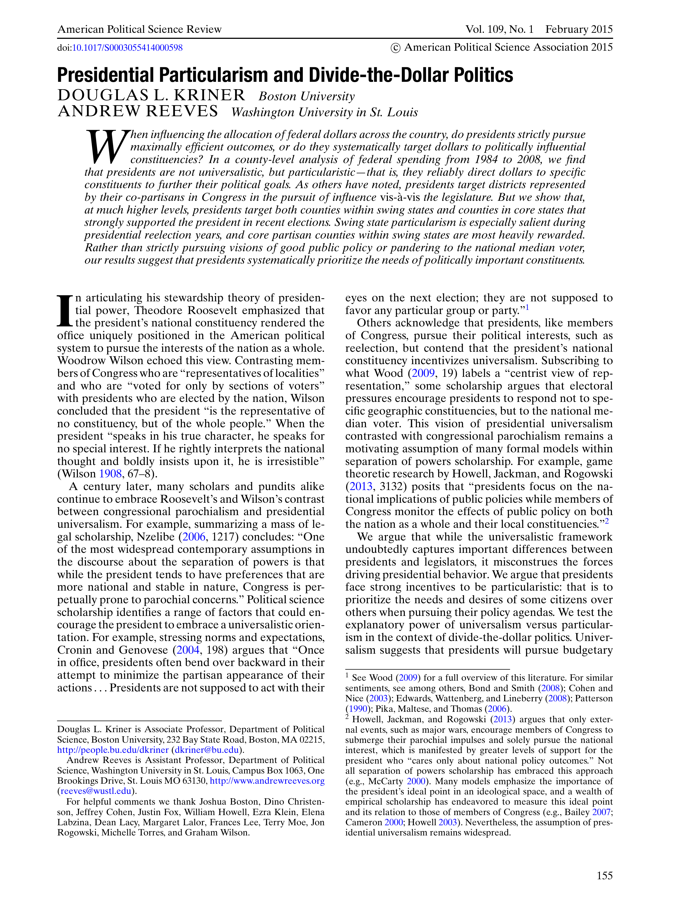

{.featured-image}

## Research Question

Do presidents allocate federal funds in a universalistic manner to benefit the nation as a whole, or do they target politically strategic constituencies?

## Main Finding

Presidents act particularistically, directing disproportionate federal resources to counties in swing states and to core partisan constituencies, especially during reelection campaigns. They prioritize electoral advantage over national interest.

## Research Design

County-level statistical analysis of federal spending from 1984 to 2008, with attention to political characteristics of recipient areas and electoral cycles.

## Data Employed

Federal budget allocation data matched to electoral returns and county characteristics, with models distinguishing between core, swing, and opposition areas.

## Substantive Importance

This study refutes the normative image of presidents as universalistic national leaders. It demonstrates systematic political favoritism in budget allocations, raising important concerns about equity, accountability, and the role of electoral incentives in federal governance.

## Research Areas

Presidential Particularism, Distributive Politics, Swing States, County-Level Analysis, Quantitative Methods

## Citation

```bibtex
@article{targeting,
  author = {Kriner, Douglas L. and Reeves, Andrew},
  title = {Presidential Particularism and Divide-the-Dollar Politics},
  journal = {{American Political Science Review}},
  volume = {109},
  number = {1},
  pages = {155--171},
  year = {2015},
}
```

## Links

- [📄 PDF](/papers/targeting.pdf)
- [🎓 Google Scholar](https://scholar.google.com/scholar?q=Presidential%20Particularism%20and%20Divide-the-Dollar%20Politics)