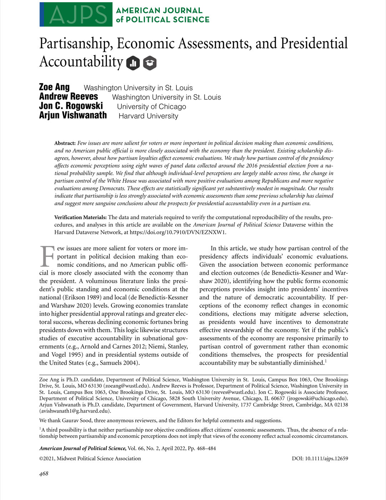

{.featured-image}

## Research Areas

Presidential Accountability, Partisanship, Economic Voting, Electoral Behavior, Public Opinion, Retrospective Voting

## Citation

```bibtex
@article{transition,
  author = {Ang, Zoe and Reeves, Andrew and Rogowski, Jon C. and Vishwanath, Arjun},
  title = {Partisanship, Economic Assessments, and Presidential Accountability},
  journal = {{American Journal of Political Science}},
  volume = {66},
  number = {2},
  pages = {468--484},
  year = {2022},
}
```

## Links

- [📄 PDF](../../papers/transition.pdf)
- [🎓 Google Scholar](https://scholar.google.com/scholar?q=Partisanship%2C%20Economic%20Assessments%2C%20and%20Presidential%20Accountability)