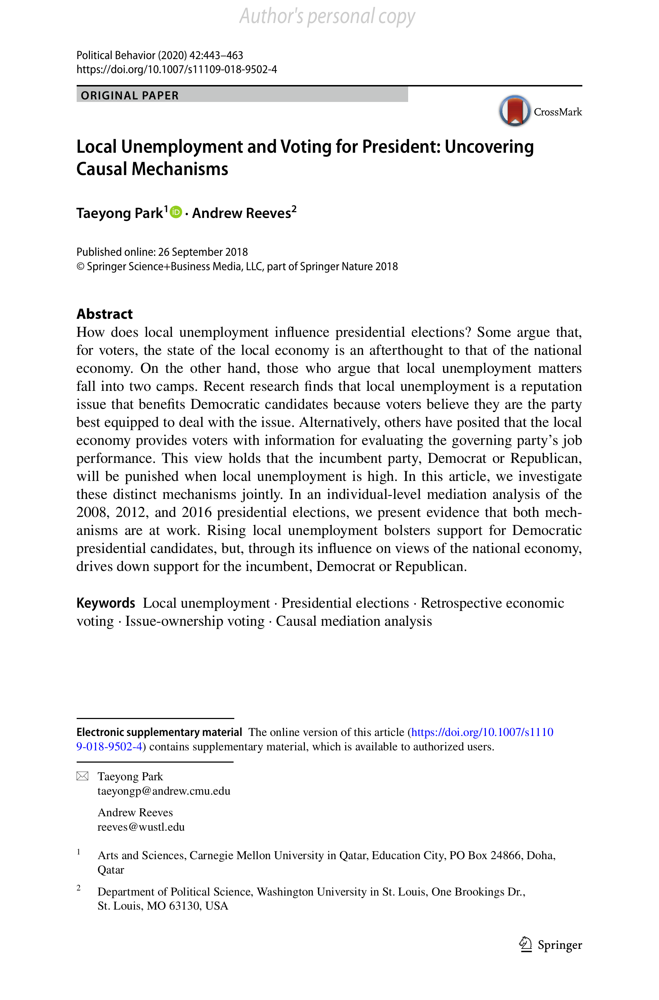

{.featured-image}

## Research Question

How does local unemployment shape presidential vote choice, and through which mechanisms does that effect operate?

## Main Finding

Rising local unemployment activates two mechanisms at once. It reduces support for the incumbent party through more negative evaluations of the national economy, while also increasing support for Democratic candidates through local issue ownership. Both dynamics are present in the same elections.

## Research Design

Individual-level causal mediation analysis that decomposes the total electoral effect of local unemployment into an indirect pathway (via national economic perceptions) and a direct pathway (party reputation/issue ownership).

## Data Employed

Cooperative Congressional Election Study (CCES) surveys from 2008, 2012, and 2016 (nationally representative YouGov/Polimetrix samples) matched to county-level unemployment measures from BLS Local Area Unemployment Statistics, with additional local economic controls.

## Substantive Importance

The study clarifies why earlier work often found weak or inconsistent local economic effects on presidential voting: opposing mechanisms can offset each other. It shows that local economic conditions matter for national elections, but in ways that depend on both accountability judgments and partisan reputations.

## Research Areas

Economic Voting, Geographic Context, Presidential Elections, County-Level Analysis, Quantitative Methods

## Citation

```bibtex
@article{unemployment,
  author = {Park, Taeyong and Reeves, Andrew},
  title = {Local Unemployment and Voting for President: Uncovering Causal Mechanisms},
  journal = {Political Behavior},
  volume = {42},
  number = {2},
  pages = {443--463},
  year = {2020},
}
```

## Links

- [📄 PDF](../../papers/unemployment.pdf)
- [🎓 Google Scholar](https://scholar.google.com/scholar?q=Local%20Unemployment%20and%20Voting%20for%20President%3A%20Uncovering%20Causal%20Mechanisms)
