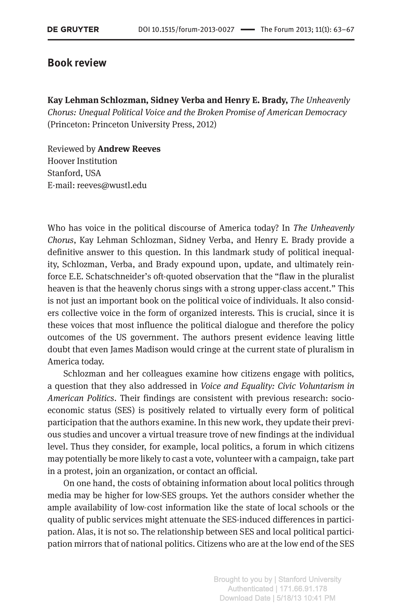

{.featured-image}

## Research Areas

Book Review, Electoral Behavior, Democratic Accountability, Public Opinion

## Citation

```bibtex
@article{unheavenly-review,
  author = {Reeves, Andrew},
  title = {Review of <i>The Unheavenly Chorus: Unequal Political Voice and the Broken Promise of Democracy</i> by Kay Lehman Schlozman, Sidney Verba, and Henry E. Brady},
  journal = {The Forum},
  volume = {11},
  number = {1},
  pages = {63--67},
  year = {2013},
}
```

## Links

- [📄 PDF](/papers/unheavenly-review.pdf)
- [🎓 Google Scholar](https://scholar.google.com/scholar?q=Review%20of%20%3Ci%3EThe%20Unheavenly%20Chorus%3A%20Unequal%20Political%20Voice%20and%20the%20Broken%20Promise%20of%20Democracy%3C/i%3E%20by%20Kay%20Lehman%20Schlozman%2C%20Sidney%20Verba%2C%20and%20Henry%20E.%20Brady)