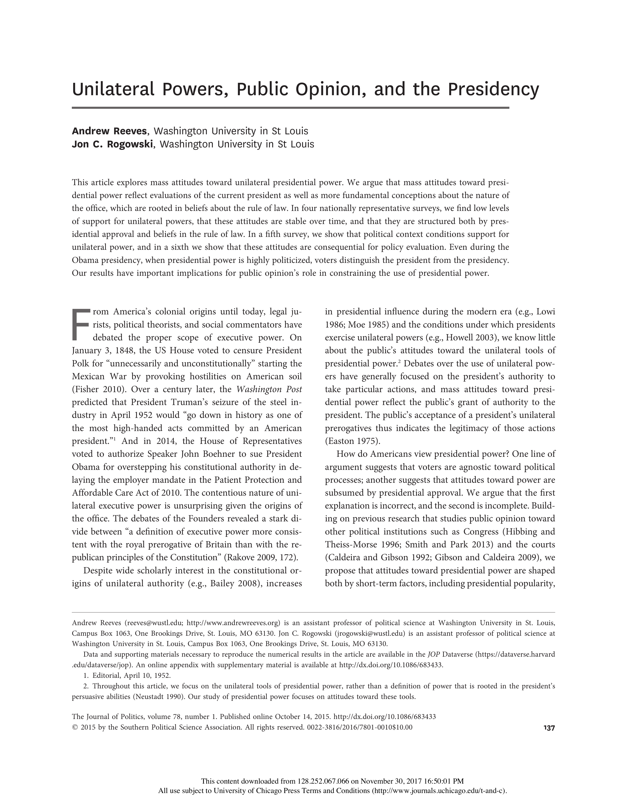

{.featured-image style="max-width: 600px; max-height: 400px; width: auto; height: auto;"}

## Research Areas

Presidential Power, Public Opinion, Institutional Design, Democratic Accountability, Quantitative Methods

## Citation

```bibtex
@article{unilateral,
  author = {Reeves, Andrew and Rogowski, Jon C.},
  title = {Unilateral Powers, Public Opinion, and the Presidency},
  journal = {Journal of Politics},
  volume = {78},
  number = {1},
  pages = {137--151},
  year = {2016},
}
```

## Links

- [📄 PDF](/papers/unilateral.pdf)
- [🎓 Google Scholar](https://scholar.google.com/scholar?q=Unilateral%20Powers%2C%20Public%20Opinion%2C%20and%20the%20Presidency)