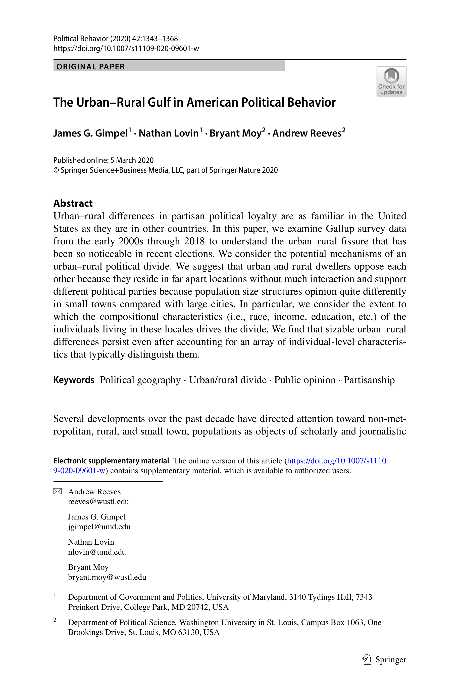

{.featured-image}

## Research Question

To what extent is the urban-rural divide in American politics explained by who lives in these places versus the geographic context of those places?

## Main Finding

A substantial urban-rural partisan divide remains even after accounting for individual-level composition. Democrats are more concentrated in denser areas close to major cities, while Republicans are more concentrated in less dense, more remote places.

## Research Design

Observational analysis of repeated cross-sectional survey data linked to ZIP-based geography, modeling partisanship and political attitudes across urban-rural contexts.

## Data Employed

Gallup Poll Social Series data from 2003-2018 (nearly 125,000 respondents, including roughly 25,000 from small-town and rural areas), merged with ZIP-code measures of distance to major cities and local population density.

## Substantive Importance

The study shows that geographic context has an independent relationship with political behavior beyond standard demographic factors. It helps explain why polarization increasingly maps onto place and why urban-rural political conflict persists.

## Research Areas

Electoral Geography, Urban-Rural Divide, Polarization, Electoral Behavior, Geographic Context

## Citation

```bibtex
@article{urbanrural,
  author = {Gimpel, James G. and Lovin, Nathan and Moy, Bryant and Reeves, Andrew},
  title = {The Urban-Rural Gulf in {A}merican Political Behavior},
  journal = {Political Behavior},
  volume = {42},
  number = {4},
  pages = {1343--1368},
  year = {2020},
}
```

## Links

- [📄 PDF](../../papers/urbanrural.pdf)
- [🎓 Google Scholar](https://scholar.google.com/scholar?q=The%20Urban-Rural%20Gulf%20in%20American%20Political%20Behavior)
