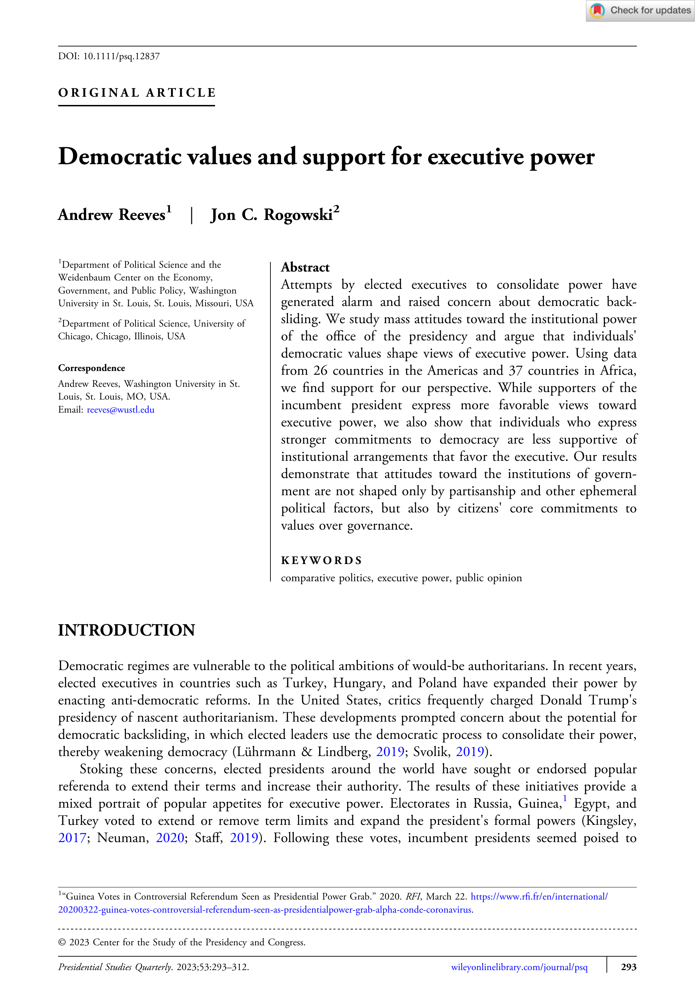

{.featured-image style="max-width: 600px; max-height: 400px; width: auto; height: auto;"}

## Research Question

Do citizens' democratic values shape their attitudes toward executive power, and can these values serve as a constraint on executive overreach and democratic backsliding?

## Main Finding

Citizens with stronger commitments to democracy consistently express less support for executive power across multiple measures and contexts. While supporters of incumbent presidents favor expanded executive authority, democratic values independently constrain support for executive overreach, suggesting mass publics can serve as a "guardrail" against democratic erosion.

## Research Design

The study employs both aggregate country-level analysis and individual-level regression models with country-wave fixed effects, testing two competing theories: that attitudes toward executive power reflect partisan alignment versus core democratic commitments. The analysis includes interaction models to test whether democratic values operate differently among presidential supporters and opponents.

## Data Employed

Survey data from AmericasBarometer (26 countries, 2010-2019) and Afrobarometer (37 countries, 2000-2019), measuring attitudes toward various forms of executive power (closing legislatures, dissolving courts, governing without constraints) alongside measures of democratic support and presidential approval.

## Substantive Importance

This research challenges pessimistic accounts of democratic backsliding by demonstrating that citizens' procedural commitments to democracy can meaningfully constrain executive ambitions. The findings suggest that public opinion represents a potential defense mechanism against authoritarian-minded executives, with important implications for understanding democratic resilience across diverse political systems.

## Research Areas

Presidential Power, Democratic Accountability, Comparative Politics, Survey Research, Normative Theory

## Citation

```bibtex
@article{values,
  author = {Reeves, Andrew and Rogowski, Jon C.},
  title = {Democratic Values and Support for Executive Power},
  journal = {Presidential Studies Quarterly},
  volume = {53},
  number = {2},
  pages = {293--312},
  year = {2023},
}
```

## Links

- [📄 PDF](/papers/values.pdf)
- [🏛️ Publisher](https://onlinelibrary.wiley.com/doi/abs/10.1111/psq.12837)
- [🎓 Google Scholar](https://scholar.google.com/scholar?q=Democratic%20Values%20and%20Support%20for%20Executive%20Power)