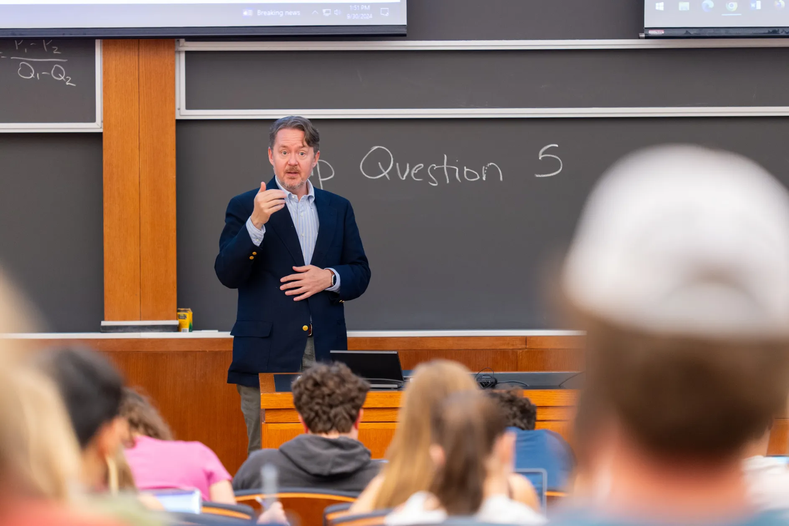
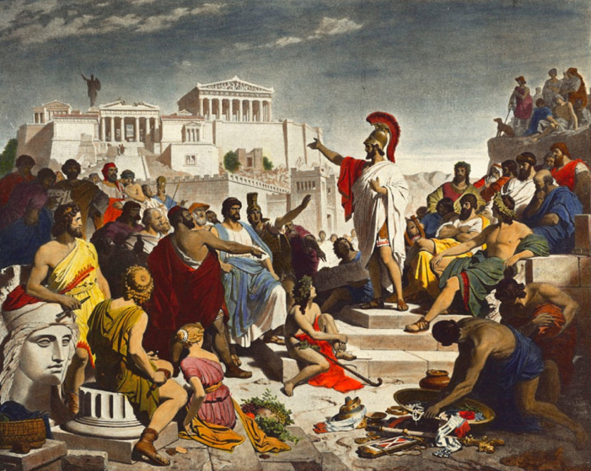
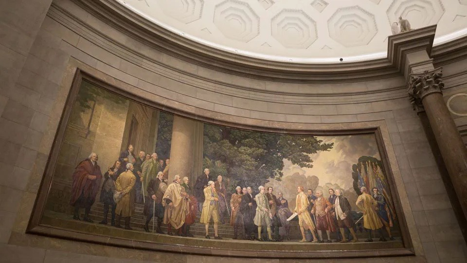

::: {.simple-layout}
::: {.page-intro}
## <i class="fa-solid fa-chalkboard-user" aria-hidden="true"></i> Courses, Mentorship, and Civic Learning {.page-intro-title}
Course design and teaching in American politics, democratic citizenship, and electoral strategy.
:::

::: {.teaching-spotlight}
::: {.teaching-spotlight-media}
{.teaching-spotlight-photo alt="Andrew Reeves teaching in the classroom"}
:::

::: {.teaching-spotlight-copy}
<span class="teaching-spotlight-kicker">Classroom Practice</span>

Reeves’s teaching emphasizes analytical rigor, close reading of evidence, and practical democratic reasoning. Courses are designed to connect institutional analysis with real-world civic judgment.
:::
:::

::: {.section}
## Teaching Awards {.section-title}

Selected teaching honors at Washington University in St. Louis.

::: {.grid-2}
::: {.card}
### David Hadas Teaching Award

Recognizes a tenured Arts & Sciences faculty member for exceptional commitment to first-year undergraduate teaching.

[Washington University Arts & Sciences: David Hadas Teaching Award](https://insideartsci.wustl.edu/david-hadas-teaching-award)
:::

::: {.card}
### Delores K. Kennedy Award

Recognizes a member of the Washington University community whose commitment to students strengthens the first-year experience.

[Political Science News: Prof. Andrew Reeves wins Delores K. Kennedy Award](https://polisci.wustl.edu/news/prof-andrew-reeves-wins-delores-k-kennedy-award#:~:text=This%20award%20recognizes%20a%20member,in%20Introduction%20to%20American%20Politics.)
:::
:::
:::

::: {.section}
## Courses {.section-title}

Courses on American politics, the presidency, and electoral strategy.

::: {.grid-2}
::: {.card}
### The Practice of Citizenship: Cooperation and Obligations in Democratic Life

{fig-alt="Pericles delivering the funeral oration in Athens (Philipp Foltz, 1852)"}

**Undergraduate Course**

This course treats citizenship as both democratic practice and a solution to cooperation problems. Students engage political theory, American political voices, and empirical research to ask which civic capacities sustain democracy and what obligations citizens and institutions share in developing them. Readings span Aristotle to MLK and contemporary work on trust, polarization, and civic education.

[Syllabus](../practice-of-citizenship-syllabus-spring-2026.pdf){.btn .btn-outline target="_blank" rel="noopener noreferrer"}
:::

::: {.card}
### Introduction to American Politics

{fig-alt="Introduction to American Politics course visual"}

**Undergraduate Course**

This course examines American politics in a period of polarization, institutional strain, and economic dissatisfaction. Students analyze how current conflicts emerged and what they suggest about the future of U.S. governance.

The first half introduces core political science concepts and institutional foundations. Students then study the operation and evolution of the legislative, judicial, and executive branches. This course is offered intermittently.

**Course Introduction Video:**

```{=html}
<div class="video-frame" style="margin-top: 1rem;">
  <iframe src="https://www.youtube.com/embed/ZcPzyOfqNKQ" title="Introduction to American Politics course video" frameborder="0" allow="accelerometer; autoplay; clipboard-write; encrypted-media; gyroscope; picture-in-picture; web-share" loading="lazy" referrerpolicy="strict-origin-when-cross-origin" allowfullscreen></iframe>
</div>
```

[Syllabus](https://docs.google.com/document/u/0/d/e/2PACX-1vQEwsc-KnpOY1IIwf8QzK6P0d4cSRdFKf8xxJ9AEhS_55LbCgezSwSWuKN-Sse9Kg561KUWttA7S1-k/pub?pli=1){.btn .btn-outline target="_blank" rel="noopener noreferrer"}
:::

::: {.card}
### Business of Elections

{fig-alt="Business of Elections course visual"}

**Undergraduate Course**

This course analyzes presidential elections through political science and business strategy. Topics include campaign management, voter targeting, messaging, and the organizational logic of modern national campaigns.

**Course Coverage**

- [How a Presidential Election Start-up Could Help Us Rebuild Democracy](https://artsci.washu.edu/ampersand/how-presidential-election-start)
- [New Course Studies the Business of Politics](https://olin.washu.edu/about/news-and-media/news/2021/03/new-course-studies-the-business-of-politics.php)
:::
:::
:::
:::
